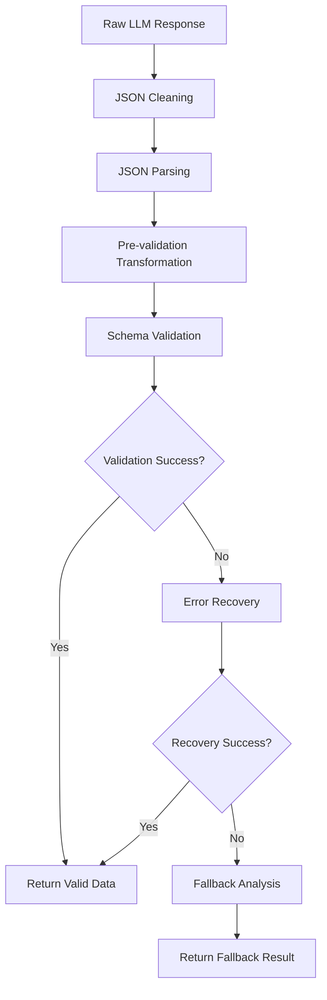

# Transformation and Validation Pipeline

This document provides detailed information about Nova's Enhanced Code Review Agent transformation and validation pipeline, which handles LLM response processing and error recovery.

## Table of Contents

- [Overview](#overview)
- [Pipeline Architecture](#pipeline-architecture)
- [Transformation Rules](#transformation-rules)
- [Validation Strategies](#validation-strategies)
- [Error Recovery](#error-recovery)
- [Configuration](#configuration)
- [Monitoring and Debugging](#monitoring-and-debugging)
- [Examples](#examples)

## Overview

The transformation and validation pipeline is a multi-stage system that processes LLM responses and ensures they conform to expected schemas. It handles common issues like type mismatches, format variations, and malformed responses through intelligent transformation and error recovery.

### Key Features

- **Automatic Type Conversion**: Converts string values to expected types (numbers, booleans)
- **Format Normalization**: Handles various input formats (percentages, boolean strings)
- **Error Recovery**: Multiple recovery strategies when validation fails
- **Graceful Degradation**: Falls back to rule-based analysis when all else fails
- **Detailed Logging**: Comprehensive logging for debugging and monitoring

## Pipeline Architecture

### Processing Stages



### Stage Details

1. **JSON Cleaning**: Removes markdown code blocks, fixes common JSON issues
2. **JSON Parsing**: Parses cleaned JSON string into JavaScript object
3. **Pre-validation Transformation**: Applies known transformations before validation
4. **Schema Validation**: Validates against strict Zod schemas
5. **Error Recovery**: Attempts multiple recovery strategies if validation fails
6. **Fallback Analysis**: Uses rule-based analysis as last resort

## Transformation Rules

### Coverage Field Transformations

The coverage field accepts various input formats and normalizes them to numbers (0-100):

```typescript
// Input formats and their transformations
"75%" → 75          // Percentage strings
"75" → 75           // String numbers
"75.5" → 76         // Decimal numbers (rounded)
"invalid" → 0       // Invalid strings (fallback)
null → 0            // Null values (fallback)
undefined → 0       // Undefined values (fallback)
150 → 100           // Values > 100 (clamped)
-10 → 0             // Negative values (clamped)
```

**Implementation:**
```typescript
function transformCoverageField(value: unknown): number {
  if (typeof value === 'number') {
    return Math.min(100, Math.max(0, value));
  }
  
  if (typeof value === 'string') {
    // Remove percentage signs and whitespace
    const cleaned = value.replace(/[%\s]/g, '');
    const parsed = parseFloat(cleaned);
    
    if (isNaN(parsed)) return 0;
    return Math.min(100, Math.max(0, Math.round(parsed)));
  }
  
  return 0; // Fallback for null, undefined, etc.
}
```

### Boolean Field Transformations

Boolean fields (like `testsPresent`) accept various truthy/falsy representations:

```typescript
// Truthy values
"true" → true       // String boolean
"TRUE" → true       // Case insensitive
"1" → true          // Numeric string
"yes" → true        // Common affirmative
"on" → true         // Switch-like value
1 → true            // Numeric boolean

// Falsy values
"false" → false     // String boolean
"FALSE" → false     // Case insensitive
"0" → false         // Numeric string
"no" → false        // Common negative
"off" → false       // Switch-like value
0 → false           // Numeric boolean
null → false        // Null fallback
undefined → false   // Undefined fallback
```

**Implementation:**
```typescript
function transformBooleanField(value: unknown): boolean {
  if (typeof value === 'boolean') return value;
  
  if (typeof value === 'string') {
    const lower = value.toLowerCase().trim();
    return ['true', '1', 'yes', 'on'].includes(lower);
  }
  
  if (typeof value === 'number') {
    return value !== 0;
  }
  
  return false; // Fallback
}
```

### Grade Field Validation

Grade fields must be one of the valid enum values:

```typescript
// Valid grades
"A" → "A"           // Excellent
"B" → "B"           // Good
"C" → "C"           // Average
"D" → "D"           // Below Average
"F" → "F"           // Poor

// Invalid grades (cause validation error)
"A+" → ValidationError
"Pass" → ValidationError
"Good" → ValidationError
```

### Array Field Handling

Array fields (issues, suggestions) are normalized to ensure they're always arrays:

```typescript
// Input transformations
[] → []             // Empty array
null → []           // Null to empty array
undefined → []      // Undefined to empty array
"string" → ["string"] // Single string to array
```

## Validation Strategies

### Schema Definitions

The pipeline uses two types of schemas:

#### Strict Schema (Target)
```typescript
const StrictReviewSchema = z.object({
  grade: z.enum(['A', 'B', 'C', 'D', 'F']),
  coverage: z.number().min(0).max(100),
  testsPresent: z.boolean(),
  value: z.enum(['high', 'medium', 'low']),
  state: z.enum(['pass', 'warning', 'fail']),
  issues: z.array(CodeIssueSchema),
  suggestions: z.array(z.string()),
  summary: z.string(),
});
```

#### Flexible Schema (Input)
```typescript
const FlexibleReviewSchema = z.object({
  grade: z.enum(['A', 'B', 'C', 'D', 'F']),
  coverage: z.union([z.number(), z.string()]).transform(transformCoverageField),
  testsPresent: z.union([z.boolean(), z.string()]).transform(transformBooleanField),
  value: z.enum(['high', 'medium', 'low']),
  state: z.enum(['pass', 'warning', 'fail']),
  issues: z.array(CodeIssueSchema).default([]),
  suggestions: z.array(z.string()).default([]),
  summary: z.string().default('Analysis completed'),
});
```

### Validation Process

1. **Primary Validation**: Attempt validation with flexible schema
2. **Transformation Application**: Apply field-specific transformations
3. **Secondary Validation**: Validate transformed data with strict schema
4. **Error Recovery**: If validation fails, attempt recovery strategies

## Error Recovery

### Recovery Strategies

The pipeline implements multiple recovery strategies, applied in order:

#### 1. Type Coercion
Attempts to convert types using known transformation rules:

```typescript
async function attemptTypeCoercion(error: z.ZodError, data: unknown): Promise<RecoveryResult> {
  const transformedData = applyCommonTransformations(data, error);
  
  try {
    const validated = schema.parse(transformedData);
    return { success: true, data: validated, transformationsApplied: ['type-coercion'] };
  } catch (newError) {
    return { success: false, errors: [newError] };
  }
}
```

#### 2. Field Mapping
Maps alternative field names to expected names:

```typescript
const fieldMappings = {
  'test_coverage': 'coverage',
  'has_tests': 'testsPresent',
  'quality_grade': 'grade',
  'business_value': 'value',
  'review_state': 'state'
};
```

#### 3. Default Values
Provides sensible defaults for missing required fields:

```typescript
const defaultValues = {
  grade: 'C',
  coverage: 0,
  testsPresent: false,
  value: 'medium',
  state: 'warning',
  issues: [],
  suggestions: [],
  summary: 'Analysis completed with defaults'
};
```

#### 4. Partial Recovery
Accepts partial data and fills in missing fields:

```typescript
async function attemptPartialRecovery(error: z.ZodError, data: unknown): Promise<RecoveryResult> {
  const partialData = extractValidFields(data, error);
  const completeData = { ...defaultValues, ...partialData };
  
  try {
    const validated = schema.parse(completeData);
    return { success: true, data: validated, transformationsApplied: ['partial-recovery'] };
  } catch (newError) {
    return { success: false, errors: [newError] };
  }
}
```

### Recovery Success Tracking

The pipeline tracks recovery success rates for monitoring:

```typescript
interface RecoveryMetrics {
  totalAttempts: number;
  successfulRecoveries: number;
  failedRecoveries: number;
  recoveryStrategiesUsed: Record<string, number>;
  successRate: number;
}
```

## Configuration

### Pipeline Configuration

```typescript
interface ValidationConfig {
  enableTransformation: boolean;      // Enable automatic transformations
  enableRecovery: boolean;           // Enable error recovery
  maxRecoveryAttempts: number;       // Maximum recovery attempts per validation
  fallbackToRuleAnalysis: boolean;   // Fall back to rule-based analysis
  logTransformations: boolean;       // Log transformation details
  logRecoveryAttempts: boolean;      // Log recovery attempts
}
```

### Default Configuration

```typescript
const defaultValidationConfig: ValidationConfig = {
  enableTransformation: true,
  enableRecovery: true,
  maxRecoveryAttempts: 4,
  fallbackToRuleAnalysis: true,
  logTransformations: false,
  logRecoveryAttempts: false
};
```

### Environment Variables

```bash
# Enable detailed transformation logging
export NOVA_LOG_TRANSFORMATIONS=true

# Enable recovery attempt logging
export NOVA_LOG_RECOVERY=true

# Disable automatic recovery (for debugging)
export NOVA_DISABLE_RECOVERY=true

# Set maximum recovery attempts
export NOVA_MAX_RECOVERY_ATTEMPTS=3
```

## Monitoring and Debugging

### Logging Levels

The pipeline provides different logging levels for debugging:

```bash
# Basic logging (errors only)
nova agent enhanced-code-review-agent review src/main.ts

# Info logging (includes transformations)
NOVA_LOG_LEVEL=info nova agent enhanced-code-review-agent review src/main.ts

# Debug logging (includes all pipeline steps)
NOVA_LOG_LEVEL=debug nova agent enhanced-code-review-agent review src/main.ts

# Trace logging (includes raw responses)
NOVA_LOG_LEVEL=trace nova agent enhanced-code-review-agent review src/main.ts
```

### Log Message Examples

#### Successful Transformation
```
INFO: Applied transformation: coverage "75%" → 75
INFO: Applied transformation: testsPresent "true" → true
INFO: Validation successful after transformation
```

#### Recovery Attempt
```
WARN: Schema validation failed, attempting recovery
INFO: Recovery strategy 1 (type-coercion): SUCCESS
INFO: Validation successful after recovery
```

#### Fallback to Rule Analysis
```
ERROR: All recovery strategies failed
WARN: Falling back to rule-based analysis
INFO: Rule-based analysis completed successfully
```

### Metrics Collection

The pipeline collects metrics for monitoring:

```typescript
interface PipelineMetrics {
  totalProcessed: number;
  successfulValidations: number;
  transformationsApplied: number;
  recoveryAttempts: number;
  successfulRecoveries: number;
  fallbacksUsed: number;
  averageProcessingTime: number;
}
```

### Debug Commands

```bash
# Test transformation with specific input
echo '{"grade":"B","coverage":"75%","testsPresent":"true"}' | \
  nova debug transform-validation

# Validate specific response format
nova debug validate-response --file response.json

# Show transformation rules
nova debug show-transformations

# Test recovery strategies
nova debug test-recovery --error-type validation
```

## Examples

### Example 1: Successful Transformation

**Input (LLM Response):**
```json
{
  "grade": "B",
  "coverage": "75%",
  "testsPresent": "true",
  "value": "high",
  "state": "pass",
  "issues": [],
  "suggestions": ["Add more unit tests"],
  "summary": "Good code quality"
}
```

**Processing:**
1. JSON parsing: ✅ Success
2. Pre-validation transformation:
   - `coverage: "75%" → 75`
   - `testsPresent: "true" → true`
3. Schema validation: ✅ Success

**Output:**
```json
{
  "grade": "B",
  "coverage": 75,
  "testsPresent": true,
  "value": "high",
  "state": "pass",
  "issues": [],
  "suggestions": ["Add more unit tests"],
  "summary": "Good code quality"
}
```

### Example 2: Recovery from Validation Error

**Input (Malformed Response):**
```json
{
  "quality_grade": "B",
  "test_coverage": "invalid",
  "has_tests": "1",
  "business_value": "high"
}
```

**Processing:**
1. JSON parsing: ✅ Success
2. Schema validation: ❌ Failed (missing fields, wrong field names)
3. Recovery attempt 1 (field mapping):
   - `quality_grade → grade`
   - `test_coverage → coverage`
   - `has_tests → testsPresent`
   - `business_value → value`
4. Recovery attempt 2 (type coercion + defaults):
   - `coverage: "invalid" → 0`
   - `testsPresent: "1" → true`
   - Add missing fields with defaults
5. Schema validation: ✅ Success

**Output:**
```json
{
  "grade": "B",
  "coverage": 0,
  "testsPresent": true,
  "value": "high",
  "state": "warning",
  "issues": [],
  "suggestions": [],
  "summary": "Analysis completed with defaults"
}
```

### Example 3: Fallback to Rule Analysis

**Input (Completely Invalid Response):**
```
This is not JSON at all, just plain text response from LLM
```

**Processing:**
1. JSON parsing: ❌ Failed
2. JSON cleaning: ❌ Still invalid
3. All recovery strategies: ❌ Failed
4. Fallback to rule-based analysis: ✅ Success

**Output:**
```json
{
  "grade": "C",
  "coverage": 0,
  "testsPresent": false,
  "value": "medium",
  "state": "warning",
  "issues": [
    {
      "line": 1,
      "severity": "medium",
      "type": "style",
      "message": "Consider adding proper error handling"
    }
  ],
  "suggestions": ["Add comprehensive error handling"],
  "summary": "Rule-based analysis completed (LLM response invalid)"
}
```

This transformation and validation pipeline ensures that the Enhanced Code Review Agent can handle a wide variety of LLM response formats and gracefully recover from common issues, providing reliable and consistent results to users.