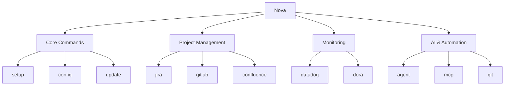

# Command Reference

This page provides a comprehensive reference of all commands available in Nova CLI. Use the search
function or the table of contents to quickly find specific commands.

## Command Structure

Nova commands follow a consistent structure:

```bash
nova <command> [subcommand] [options]
```

The diagram below shows the high-level command organization:



## Planned Features

The following commands are planned for future releases and are not currently available:

- **GitHub**: Manage GitHub repositories, issues, and pull requests
- **Slack**: Integration for team communication and notifications

## Core Commands

### Setup

Initialize and configure Nova CLI with your credentials and preferences.

[➡️ Details](user-guide/commands/setup.md)

```bash
nova setup [--force] [--minimal] [--skip-test]
```

### Config

View, modify, or test Nova configuration settings.

[➡️ Details](user-guide/commands/config.md)

```bash
nova config list
nova config get <key>
nova config set <key> <value>
nova config test
```

### Update

Check for and install updates to Nova CLI.

[➡️ Details](user-guide/commands/update.md)

```bash
nova update [--check]
```

## Project Management

### Jira

Interact with Jira projects, issues, and reports.

[➡️ Details](user-guide/commands/jira.md)

```bash
nova jira projects
nova jira issues [project]
nova jira dashboard
nova jira open <issue-key>
```

### GitLab

Manage GitLab projects, issues, merge requests, and metrics.

[➡️ Details](user-guide/commands/gitlab.md)

```bash
nova gitlab projects
nova gitlab dashboard
```

### Confluence

Work with Confluence spaces, pages, and content.

[➡️ Details](user-guide/commands/confluence.md)

```bash
nova confluence spaces
nova confluence pages
nova confluence search <query>
nova confluence dashboard
nova confluence page <page-id>
```

## Infrastructure

### Git

Git operations and semantic releases.

[➡️ Details](user-guide/commands/git.md)

```bash
nova git [subcommand]
```

## Monitoring

### Datadog

Access and interact with Datadog resources.

[➡️ Details](user-guide/commands/datadog.md)

```bash
nova datadog teams
nova datadog dashboards
```

### DORA Metrics

View and analyze DORA (DevOps Research and Assessment) metrics.

[➡️ Details](user-guide/commands/dora.md)

```bash
nova dora metrics
```

## AI & Automation

### Agent

Use AI-powered agents for code review, project management, and more.

[➡️ Details](user-guide/commands/agent.md)

```bash
nova agent eng
nova agent eng review [file/dir]
nova agent eng review-mr
```

### MCP

Manage Model Context Protocol operations for AI tool integration.

[➡️ Details](user-guide/commands/mcp.md)

```bash
nova mcp setup
nova mcp server
```

## Global Options

These options are available for most commands:

| Option                  | Description                   |
| ----------------------- | ----------------------------- |
| `-f, --format <format>` | Output format (text/json)     |
| `-r, --recent`          | Use most recent project/space |
| `--refresh`             | Force refresh cached data     |
| `-h, --help`            | Show help information         |
| `-v, --version`         | Show version information      |

## Command Completion

Nova supports command completion for Bash and Zsh. To enable command completion, use the following
commands:

### Bash Completion

```bash
nova completions bash > ~/.nova_completions
echo 'source ~/.nova_completions' >> ~/.bashrc
```

### Zsh Completion

```bash
nova completions zsh > ~/.nova_completions.zsh
echo 'source ~/.nova_completions.zsh' >> ~/.zshrc
```

## Planned Features Documentation

For detailed documentation on planned features, see:

- [GitHub Command (Planned Feature)](user-guide/commands/github.md)
- [Slack Command (Planned Feature)](user-guide/commands/slack.md)
