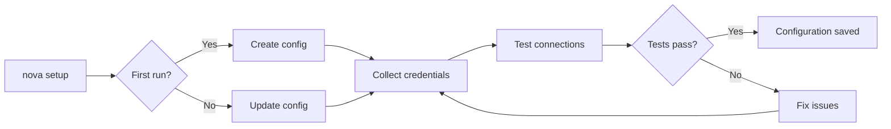
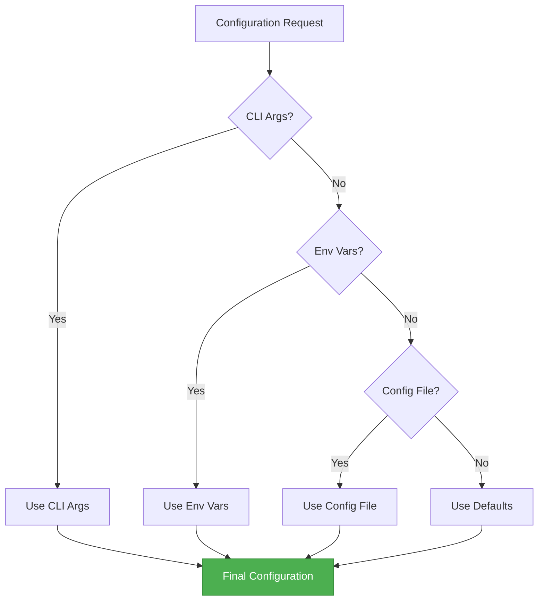

# Configuration Guide

This guide covers different ways to configure Nova CLI for your development workflow and integrate
it with various services.

## Configuration Methods

<div class="grid cards" markdown>

- :wrench: **Interactive Setup**

  ---

  The easiest way to configure nova CLI

  ```bash
  nova setup
  ```

  [➡️ Interactive Setup](#interactive-setup)

- :gear: **Configuration File**

  ---

  Configure using JSON configuration files

  ```json
  {
    "gitlab": { "token": "..." }
  }
  ```

  [➡️ File Configuration](#configuration-file)

- :package: **Environment Variables**

  ---

  Configure through environment variables

  ```bash
  export GITLAB_TOKEN="..."
  ```

  [➡️ Environment Variables](#environment-variables)

</div>

### Interactive Setup

The setup assistant provides a guided configuration experience:



Run the interactive setup wizard:

```bash
# Start interactive setup
nova setup
```

!!! note Basic Options | Option | Description | |--------|-------------| | `--force` | Force
reconfiguration of all settings | | `--minimal` | Configure only essential settings | |
`--skip-tests` | Skip connection tests |

!!! note Service-Specific Options | Option | Description | |--------|-------------| |
`--gitlab <token>` | Set GitLab token directly | | `--jira <token>` | Set Jira token directly | |
`--ollama` | Configure Ollama LLM settings |

!!! note Example
`bash
    # Configure with GitLab token and skip tests
    nova setup --gitlab glpat-XXXXXXXXXXXX --skip-tests`

### Configuration File

Nova uses a JSON configuration file located at `~/.nova/config.json`:

!!! example "Configuration File Structure"

    ```json
    {
      "atlassian": {
        "username": "your-username",
        "confluence_token": "your-token",
        "confluence_url": "your-confluence-url",
        "jira_token": "your-token",
        "jira_url": "your-jira-url"
      },
      "gitlab": {
        "url": "your-gitlab-url",
        "token": "your-token"
      },
      "ai": {
        "provider": "openai",
        "settings": {
          "api_key": "your-api-key",
          "model": "gpt-4"
        }
      }
    }
    ```

You can create or edit this file directly, or use the configuration commands:

```bash
# View current configuration
nova config show

# Set individual values
nova config set gitlab.token "your-new-token"
```

### Environment Variables

nova respects these environment variables:

| Category      | Variables                                           | Example                                              |
| ------------- | --------------------------------------------------- | ---------------------------------------------------- |
| **Core**      | `NOVA_CONFIG_PATH`<br>`nova_DEBUG`                  | `export NOVA_CONFIG_PATH=~/.config/nova/config.json` |
| **Atlassian** | `ATLASSIAN_TOKEN`<br>`JIRA_URL`<br>`CONFLUENCE_URL` | `export ATLASSIAN_TOKEN="your-token"`                |
| **GitLab**    | `GITLAB_TOKEN`<br>`GITLAB_URL`                      | `export GITLAB_TOKEN="your-token"`                   |
| **AI**        | `OPENAI_API_KEY`<br>`OPENAI_MODEL`                  | `export OPENAI_API_KEY="your-key"`                   |

!!! tip "Shell Configuration" Add frequently used variables to your `.bashrc` or `.zshrc` file:
`bash
    # nova configuration
    export NOVA_DEBUG=true
    export GITLAB_URL="https://gitlab.company.com"`

## Service Integration Setup

<div class="grid cards" markdown>

- :gitlab: **GitLab**

  ---

  Configure GitLab for project management

  [➡️ GitLab Setup](#gitlab)

- :jira: **Atlassian**

  ---

  Configure Jira and Confluence

  [➡️ Atlassian Setup](#atlassian-jiraconfluence)

- :brain: **AI**

  ---

  Configure AI providers

  [➡️ AI Setup](#ai-providers)

</div>

### GitLab

!!! note Required Permissions GitLab tokens need at minimum the `api` scope, and for CI/CD
operations, the `read_repository` and `write_repository` scopes.

!!! note Step 1: Create Access Token 1. Log in to GitLab 2. Go to `User Settings` → `Access Tokens`
3. Create a personal access token with at least the `api` scope 4. Copy the generated token

!!! note Step 2: Configure Nova **Option A: Using the setup wizard**
`bash
    nova setup
    # Enter your GitLab token when prompted`

    **Option B: Using config command**
    ```bash
    nova config set gitlab.token "your-gitlab-token"
    nova config set gitlab.url "https://gitlab.example.com" # For self-hosted instances
    ```

    **Option C: Using environment variables**
    ```bash
    export GITLAB_TOKEN="your-gitlab-token"
    export GITLAB_URL="https://gitlab.example.com" # For self-hosted instances
    ```

!!! note Step 3: Test Connection `bash
    nova config test gitlab`

    Expected output:
    ```
    ✓ GitLab: Connected successfully (User: Your Name, ID: 123)
    ```

### Atlassian (Jira/Confluence)

!!! note Credential Management Nova supports both API tokens and OAuth for Atlassian authentication.

!!! note Step 1: Generate API Token 1. Log in to
[Atlassian ID](https://id.atlassian.com/manage-profile/security/api-tokens) 2. Click
`Create API token` 3. Name your token (e.g., "Nova CLI") 4. Copy the generated token

!!! note Step 2: Configure nova **Option A: Using setup wizard**
`bash
    nova setup
    # Enter your Atlassian credentials when prompted`

    **Option B: Using config command**
    ```bash
    nova config set atlassian.username "your-email@example.com"
    nova config set atlassian.jira_token "your-api-token"
    nova config set atlassian.jira_url "https://your-domain.atlassian.net"
    nova config set atlassian.confluence_token "your-api-token" # Same token as Jira
    nova config set atlassian.confluence_url "https://your-domain.atlassian.net/wiki"
    ```

    **Option C: Using environment variables**
    ```bash
    export ATLASSIAN_TOKEN="your-api-token"
    export JIRA_URL="https://your-domain.atlassian.net"
    export CONFLUENCE_URL="https://your-domain.atlassian.net/wiki"
    ```

!!! note Step 3: Test Connection `bash
    nova config test jira
    nova config test confluence`

    Expected output:
    ```
    ✓ Jira: Connected successfully (User: Your Name)
    ✓ Confluence: Connected successfully (Space count: 12)
    ```

### AI Providers

Nova supports various AI providers for intelligent features:

!!! note OpenAI **Configuration:**
`bash
    nova config set ai.provider "openai"
    nova config set ai.settings.api_key "your-openai-api-key"
    nova config set ai.settings.model "gpt-4"`

    **Environment Variables:**
    ```bash
    export OPENAI_API_KEY="your-openai-api-key"
    export OPENAI_MODEL="gpt-4"
    ```

!!! note Azure OpenAI **Configuration:**
`bash
    nova config set ai.provider "azure"
    nova config set ai.settings.api_key "your-azure-api-key"
    nova config set ai.settings.endpoint "https://your-endpoint.openai.azure.com"
    nova config set ai.settings.deployment "your-deployment-name"`

    **Environment Variables:**
    ```bash
    export AZURE_OPENAI_API_KEY="your-azure-api-key"
    export AZURE_OPENAI_ENDPOINT="https://your-endpoint.openai.azure.com"
    export AZURE_OPENAI_DEPLOYMENT="your-deployment-name"
    ```

!!! note Ollama (Local) **Configuration:**
`bash
    nova config set ai.provider "ollama"
    nova config set ai.settings.model "llama3"
    nova config set ai.settings.host "http://localhost:11434"`

    **Environment Variables:**
    ```bash
    export OLLAMA_HOST="http://localhost:11434"
    export OLLAMA_MODEL="llama3"
    ```

## Configuration Priority



Nova resolves configuration values in this priority order:

1. **Command-line arguments**: Highest priority, overrides all other sources
2. **Environment variables**: Used if no command-line argument is provided
3. **Configuration file**: Used if no environment variable is found
4. **Default values**: Used as a last resort

## Advanced Configuration

### Custom Configuration Path

You can specify a custom location for your configuration file:

```bash
# Using environment variable
export NOVA_CONFIG_PATH=~/projects/my-project/nova.config.json

# Using command line
nova --config ~/projects/my-project/nova.config.json [command]
```

### Project-Specific Configuration

Create a `.nova.json` file in your project directory for project-specific settings:

```json
{
  "project": {
    "name": "my-awesome-project",
    "jira_project": "MYPROJ",
    "gitlab_project": "my-group/my-project"
  }
}
```

### Multiple Profiles

You can create multiple configuration profiles:

```bash
# Create a new profile
nova config create-profile prod
nova --profile prod config set gitlab.token "production-token"

# Use a specific profile
nova --profile prod [command]
```

## Configuration Management

| Task                  | Command                                    |
| --------------------- | ------------------------------------------ |
| View all settings     | `nova config show`                         |
| Get specific setting  | `nova config get gitlab.token`             |
| Set specific setting  | `nova config set gitlab.token "new-value"` |
| Test all connections  | `nova config test`                         |
| Test specific service | `nova config test gitlab`                  |
| List profiles         | `nova config list-profiles`                |
| Reset configuration   | `nova config reset`                        |

## Troubleshooting

!!! failure Authentication Failures **Problem**: "Could not authenticate with [service]"

    **Solutions**:
    1. Verify your token is correct and not expired
    2. Check that the service URL is correct
    3. Ensure the token has the required permissions
    4. Try regenerating a new token

!!! failure Configuration Not Found **Problem**: "Configuration file not found"

    **Solutions**:
    1. Run `nova setup` to create a new configuration
    2. Check the path specified in `NOVA_CONFIG_PATH`
    3. Create the config file manually at `~/.nova/config.json`

!!! failure Environment Variable Precedence **Problem**: Environment variables not taking precedence

    **Solutions**:
    1. Ensure the variable is exported: `export GITLAB_TOKEN=...`
    2. Check variable naming (case sensitive)
    3. Restart your terminal session

    **Debug Command**:
    ```bash
    nova config show --debug
    ```
