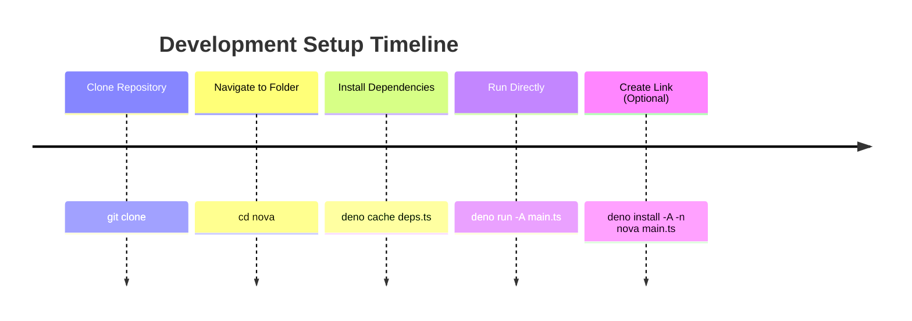

# Installation Guide

!!! tip "Quick Start"
    For a standard installation: `brew install tbh`

This guide walks you through installing and setting up nova CLI, with different options depending on your needs.

## Prerequisites
!!! Core Requirements

    - [Deno](https://deno.land/) 2.3.6 or higher
    - Git
    - macOS, Linux, or WSL (Windows Subsystem for Linux)

!!! LLM Features
    - [Ollama](https://ollama.ai/) (for local LLM support)
    - Required Ollama models downloaded
    
    ```sh
    # Download recommended models
    ollama pull llama3
    ollama pull codellama
    ```

## Installation Methods

Choose the installation method that best fits your needs:

<div class="grid cards" markdown>

- :package: __Homebrew Installation__
    tbd
    ---

    The recommended way to install nova CLI
    
    [➡️ Installation steps](#homebrew-installation)


- :wrench: __Local Development__

    ---

    Clone and run from source for development
    
    [➡️ Development setup](#local-development)

- :rocket: __CI/CD Installation__

    ---

    Automated installation for CI/CD pipelines
    
    [➡️ CI/CD setup](#cicd-installation)

</div>

### Homebrew Installation
IN THEORY --> THAT MUST BE SET UP PLEASE DONT USE THAT AT THE MOMENT


1. Tap the repository:
   ```bash
   brew tap nova-cli/tap 
   ```

2. Install nova:
   ```bash
   brew install nova
   ```

To update to the latest version:

```bash
brew update
brew upgrade nova
```

### Local Development



1. Clone the repository:
   ```bash
   git clone 
   cd nova
   ```

2. Run directly:
   ```bash
   deno run -A main.ts
   ```

3. Optionally create a link:
   ```bash
   deno install -A -n nova main.ts
   ```

### CI/CD Installation

For automated installations in CI/CD pipelines:

```bash
FAKE NOT READY YET 😭
#!/bin/bash
# Install nova CLI in CI/CD
export NOVA_NONINTERACTIVE=true

# Install without prompts
curl -fsSL /-/raw/main/install.sh | bash

# Pre-configure if needed
nova config set jira.token "$JIRA_TOKEN"
nova config set gitlab.token "$GITLAB_TOKEN"
```

## Initial Configuration

After installation, run the setup assistant:

!!! example "Setup Process"

    ```bash
    # Run full setup
    nova setup
    ```

    This interactive wizard will guide you through:
    
    - Configuring service credentials (GitLab, GitHub, Jira, Confluence, etc.)
    - Setting up LLM preferences
    - Testing connections
    - Setting default options

!!! "Basic Setup"
    ```bash
    nova setup
    ```

!!! "Skip Tests"
    ```bash
    nova setup --skip-tests
    ```

## Verification

Verify your installation with these commands:

!!! success "Verification Steps"

    !!! "Check Version"
        ```bash
        nova --version
        ```
        
        Expected output:
        ```
        nova 0.1.0
        ```
    
    !!! "Test Setup"
        ```bash
        nova
        ```
        
        Expected output:
        ```
        ✓ GitLab: Connected successfully
        ✓ Jira: Connected successfully
        ...
        ```

## Environment Setup

nova CLI supports various environment configurations:

| Variable | Description | Example |
|----------|-------------|---------|
| `NOVA_CONFIG_PATH` | Custom config location | `export NOVA_CONFIG_PATH=~/.config/nova/config.json` |
| `NOVA_DEBUG` | Enable debug logging | `export NOVA_DEBUG=true` |

## Troubleshooting

If you encounter issues during installation or setup, try these solutions:

!!! failure "Permission Errors"
    ```bash
    # Fix Deno permissions
    deno install -A -f main.ts
    ```
    
    If using Homebrew:
    ```bash
    brew doctor
    brew reinstall nova
    ```

!!! failure "Shell Integration"
    ```bash
    # Reload shell
    source ~/.zshrc  # or ~/.bashrc
    ```
    
    Check PATH setup:
    ```bash
    echo $PATH
    which nova
    ```

!!! failure "Completion Issues"
    ```bash
    # Rebuild completions
    nova completions zsh > ~/.zsh/_nova
    compinit
    ```
    
    Or for bash:
    ```bash
    nova completions bash > ~/.bash_completion.d/nova.bash
    source ~/.bash_completion.d/nova.bash
    ```

!!! failure "Dependency Problems"
    Check Deno installation:
    ```bash
    deno --version
    ```
    
    Ensure you have Deno 2.3.6 or higher:
    ```bash
    curl -fsSL https://deno.land/x/install/install.sh | sh
    ```

## Next Steps

<div class="grid cards" markdown>

- :book: __Basic Configuration__

    ---

    Learn how to configure nova for your workflow
    
    [➡️ Configuration Guide](configuration.md)

- :rocket: __First Commands__

    ---

    Start using nova with basic commands
    
    [➡️ Introduction](introduction.md)

- :gear: __Integration Setup__

    ---

    Connect nova to your services
    
    [➡️ Integrations](../user-guide/integrations/)

</div>
