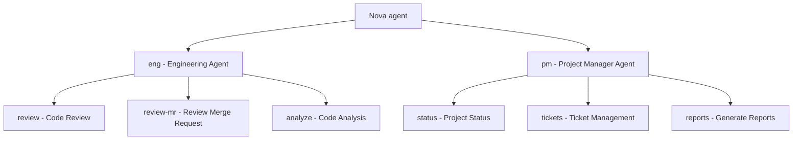

# Agent Command

The `nova agent` command provides access to AI-powered agents that can assist with various aspects
of your development workflow, including code review, project management.

!!! tip AI Assistance Agents use AI to help with complex tasks and provide intelligent insights
about your code and projects.

## Overview

Nova's agent system leverages large language models to provide context-aware assistance for
development workflows. Agents can analyze code, integrate with project management tools, and help
with various development tasks.



## Agent Types

Nova provides several specialized agents, each designed for specific use cases:

### Dev Agent

The Dev Agent (`dev`) assists with technical tasks such as code review, debugging, and optimization.

!!! "Review Code"

    ```bash
    nova agent dev review [file/directory]
    ```

    Performs an in-depth code review of specified files or directories.

    **Example:**
    ```bash
    nova agent dev review src/services/
    ```

!!! "Review Merge Request"

    ```bash
    nova agent dev review-mr
    ```

    Analyzes the current merge request in your GitLab project.

    **Example:**
    ```bash
    nova agent dev review-mr
    ```

!!! "Code Analysis"

    ```bash
    nova agent dev analyze [file/directory]
    ```

    Provides in-depth analysis of code quality, patterns, and potential issues.

    **Example:**
    ```bash
    nova agent dev analyze src/components/
    ```

### Project Manager Agent

The Project Manager agent (`pm`) helps maintain project oversight and coordination.

```bash
nova agent pm [subcommand]
```

Subcommands include:

- `status` - Sprint status tracking and updates
- `tickets` - Ticket management and prioritization
- `reports` - Generate project reports

## Agent Workflow Example

Here's how a typical code review workflow might look:

!!! example "Engineering Agent Code Review Process"

    ```
    $ nova agent eng review src/services/auth.ts

    🤖 Engineering Agent: Starting code review for src/services/auth.ts

    🔍 Analyzing code structure and patterns...
    ✓ Analysis complete

    📋 Code Review Summary:

    🟢 Strengths:
    - Well-structured authentication service
    - Good error handling for authentication failures
    - Proper use of types and interfaces

    🟠 Suggestions:
    1. Line 45: Consider using a more secure hashing algorithm like bcrypt
    2. Line 72-78: This function could be refactored to reduce complexity
    3. Line 120: Missing input validation before token generation

    ⚠️ Potential Issues:
    1. Token expiration is not checked during validation (Line 95)
    2. No rate limiting mechanism for repeated failed attempts

    💡 Recommendations:
    - Add rate limiting to prevent brute force attacks
    - Implement token refresh functionality
    - Add comprehensive input validation

    Would you like me to help implement any of these suggestions?
    ```

## Options

### Global Agent Options

| Option                  | Description                                        |
| ----------------------- | -------------------------------------------------- |
| `--model <model>`       | Specify AI model to use (default: based on config) |
| `--provider <provider>` | Specify AI provider (openai, azure, ollama)        |
| `--verbose`             | Show detailed output                               |
| `--json`                | Output results in JSON format                      |
| `-h, --help`            | Show help information                              |

### Engineering Agent Options

| Option                 | Description                              |
| ---------------------- | ---------------------------------------- |
| `--depth <depth>`      | Review depth (1-5, default: 3)           |
| `--focus <focus>`      | Focus area (security, performance, etc.) |
| `--ignores <patterns>` | Patterns to ignore (comma-separated)     |
| `--fix`                | Attempt to fix issues automatically      |

## AI Provider Configuration

Agents can use different AI providers based on your configuration:

- **OpenAI**: Uses the OpenAI API
- **Azure OpenAI**: Uses Azure's OpenAI service
- **Ollama**: Uses local Ollama models

## Advanced Usage

### Custom Prompts

You can create custom prompts for agents:

```bash
nova agent eng review --prompt "Focus on security issues and best practices" src/
```

### Combining with Other Commands

Agents work well with other nova commands:

```bash
# Review code and create Jira issues for findings
nova agent eng review src/ --create-issues

# Analyze code and update documentation
nova agent eng analyze src/ --update-docs
```

### Integration with CI/CD

nova agents can be integrated into CI/CD pipelines:

```yaml
# GitLab CI example
code-review:
  stage: test
  script:
    - nova agent eng review-mr --json > review.json
  artifacts:
    paths:
      - review.json
```

## Related Commands

- [`nova mcp`](mcp.md) - Model Context Protocol for AI tool integration
- [`nova gitlab`](gitlab.md) - GitLab operations for project management
- [`nova jira`](jira.md) - Jira operations for issue tracking
