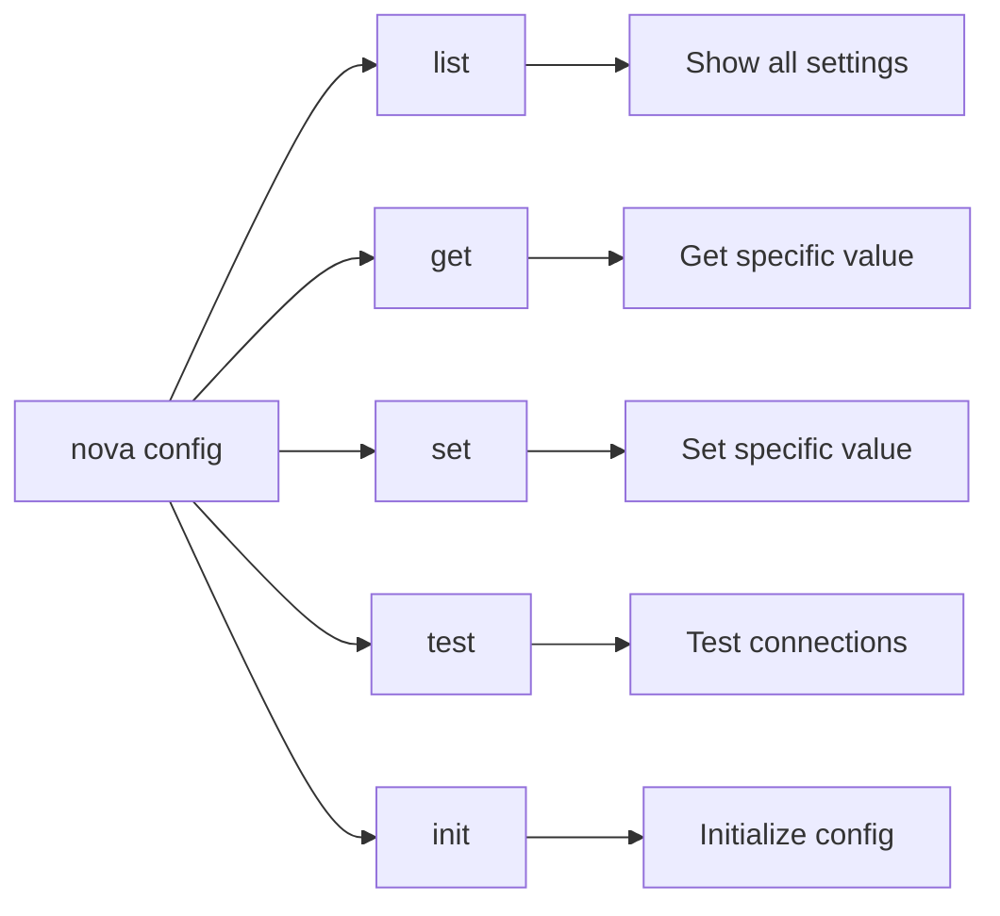
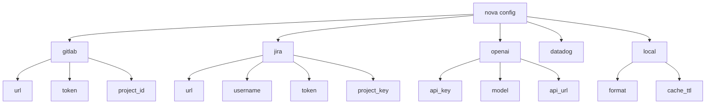

# Config Command

The `nova config` command allows you to view, manage, and test your Nova CLI configuration settings.

!!! info Configuration Management This command provides a convenient way to adjust settings without
having to run the full setup wizard again.

## Overview

The config command provides functionality to list, get, set, and test your nova configuration.



## Configuration Structure

Nova's configuration is hierarchical and organized by service:



## Usage

### List All Configuration

```bash
nova config list [options]
```

Shows a list of all configuration settings with sensitive values masked.

!!! note Basic List

    ```bash
    nova config list
    ```

!!! note JSON Output

    ```bash
    nova config list --format json
    ```

!!! note Showing Secrets

    ```bash
    nova config list --show-secrets
    ```

### Get Configuration Value

```bash
nova config get <key> [options]
```

Gets the value of a specific configuration key.

!!! note Get GitLab URL

    ```bash
    nova config get gitlab.url
    ```

!!! note Get OpenAI Model

    ```bash
    nova config get openai.model
    ```

### Set Configuration Value

```bash
nova config set <key> <value> [options]
```

Sets the value of a specific configuration key.

!!! note Set GitLab URL

    ```bash
    nova config set gitlab.url "https://gitlab.example.com"
    ```

!!! note Set OpenAI Model

    ```bash
    nova config set openai.model "gpt-4-turbo"
    ```

### Test Connections

```bash
nova config test [options]
```

Tests connections to all configured services.

!!! note Test All

    ```bash
    nova config test
    ```

!!! note Test Specific Service

    ```bash
    nova config test --service gitlab
    ```

### Initialize Configuration

```bash
nova config init [options]
```

Creates a new configuration file with default values.

!!! note Basic Init

    ```bash
    nova config init
    ```

!!! note Create .env File

    ```bash
    nova config init > .env
    ```

## Options

### Global Options

| Option                  | Description                              |
| ----------------------- | ---------------------------------------- |
| `-f, --format <format>` | Output format (text/json)                |
| `--show-secrets`        | Show sensitive values (use with caution) |
| `-h, --help`            | Show help information                    |

### Test Options

| Option                | Description                     |
| --------------------- | ------------------------------- |
| `--service <service>` | Test only the specified service |
| `--timeout <timeout>` | Connection timeout in seconds   |
| `--verbose`           | Show detailed test output       |

## Available Configuration Keys

### GitLab

| Key                 | Description           | Example Value                  |
| ------------------- | --------------------- | ------------------------------ |
| `gitlab.url`        | GitLab instance URL   | `"https://gitlab.example.com"` |
| `gitlab.token`      | Personal Access Token | `"glpat-xxxxxxx"`              |
| `gitlab.project_id` | Default project ID    | `"12345"`                      |

### GitHub

| Key                  | Description                            | Example Value                     |
| -------------------- | -------------------------------------- | --------------------------------- |
| `github.url`         | GitHub instance URL                    | `"https://github.com"`            |
| `github.token`       | Personal Access Token                  | `"ghp_xxxxxxxxxxxxxxxx"`          |
| `github.owner`       | Default owner/organization (optional)  | `"myorganization"`                |
| `github.repository`  | Default repository (optional)          | `"myproject"`                     |

### Git Provider Preferences

| Key                                 | Description                     | Example Value                    |
| ----------------------------------- | ------------------------------- | -------------------------------- |
| `gitProvider.defaultProvider`       | Default Git provider            | `"auto"`, `"gitlab"`, `"github"` |
| `gitProvider.preferredProviders`    | Provider priority for fallback | `["gitlab", "github"]`            |

### Jira

| Key                | Description         | Example Value                     |
| ------------------ | ------------------- | --------------------------------- |
| `jira.url`         | Jira instance URL   | `"https://example.atlassian.net"` |
| `jira.username`    | Jira username/email | `"user@example.com"`              |
| `jira.token`       | Jira API token      | `"xxxxx"`                         |
| `jira.project_key` | Default project key | `"PROJ"`                          |

### OpenAI

| Key              | Description         | Example Value                        |
| ---------------- | ------------------- | ------------------------------------ |
| `openai.api_key` | OpenAI API key      | `"sk-xxxxx"`                         |
| `openai.model`   | Default model       | `"gpt-4-turbo"`                      |
| `openai.api_url` | API URL (for Azure) | `"https://example.openai.azure.com"` |

### Local Settings

| Key               | Description                   | Example Value |
| ----------------- | ----------------------------- | ------------- |
| `local.format`    | Default output format         | `"text"`      |
| `local.cache_ttl` | Cache time-to-live in seconds | `3600`        |
| `local.log_level` | Logging level                 | `"info"`      |

## Example Configuration

!!! example Sample Configuration

    ```json
    {
      "gitlab": {
        "url": "https://gitlab.example.com",
        "token": "glpat-xxxxxxxx",
        "project_id": "12345"
      },
      "github": {
        "url": "https://github.com",
        "token": "ghp_xxxxxxxxxxxxxxxx",
        "owner": "myorganization",
        "repository": "myproject"
      },
      "jira": {
        "url": "https://example.atlassian.net",
        "username": "user@example.com",
        "token": "xxxxxxx",
        "project_key": "PROJ"
      },
      "openai": {
        "api_key": "sk-xxxxxxxx",
        "model": "gpt-4-turbo",
        "api_url": ""
      },
      "local": {
        "format": "text",
        "cache_ttl": 3600,
        "log_level": "info"
      }
    }
    ```

## Environment Variables

All configuration settings can be overridden with environment variables using the `NOVA_` prefix and
uppercase keys separated by underscores:

```bash
# Set GitLab URL
export NOVA_GITLAB_URL="https://gitlab.example.com"

# Set OpenAI API key
export NOVA_OPENAI_API_KEY="sk-xxxxx"
```

## Related Commands

- [`nova setup`](setup.md) - Interactive setup wizard
- [`nova update`](update.md) - Update Nova CLI to the latest version
