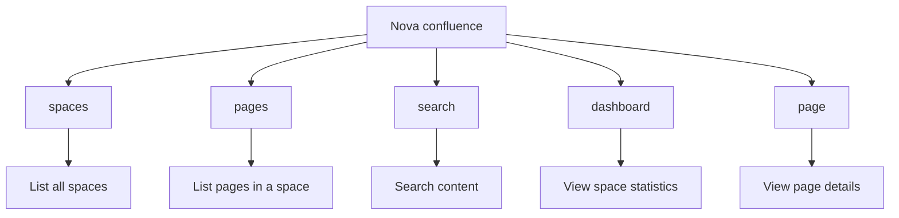
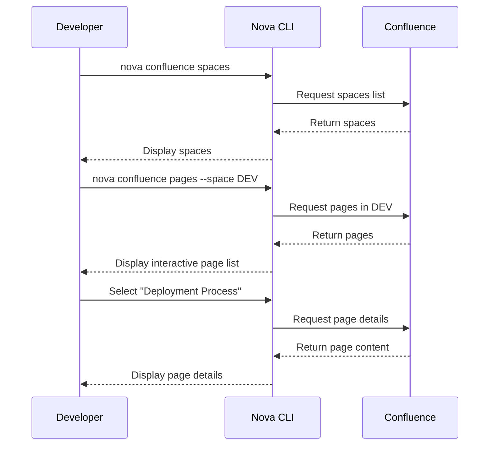

# Confluence Command

The `nova confluence` command provides a powerful interface to Atlassian Confluence directly from
your terminal, allowing you to search, browse, and analyze content across your organization's
knowledge base.

!!! info Knowledge Management This command streamlines access to your organization's documentation
and knowledge repositories without leaving the terminal.

## Overview

Nova's Confluence integration allows you to interact with your Confluence instance, making it easy
to find information, view pages, and analyze space activity without opening a browser.



## Prerequisites

Before using Confluence commands, ensure:

- You have a valid Confluence account with access to the spaces you want to interact with
- Your Nova CLI is configured with Confluence credentials
- You can configure your credentials using:

```bash
nova setup
```

## Subcommands

### Spaces

```bash
nova confluence spaces [options]
```

Lists all Confluence spaces you have access to.

!!! note Basic Usage

    ```bash
    nova confluence spaces
    ```

!!! note JSON Output

    ```bash
    nova confluence spaces --format json
    ```

#### Options

| Option                  | Description                              |
| ----------------------- | ---------------------------------------- |
| `-f, --format <format>` | Output format (text/json, default: text) |

#### Example Output

```
Fetching Confluence spaces...

┌───────────┬────────────────────────────┬───────────┐
│ Key       │ Name                       │ Type      │
├───────────┼────────────────────────────┼───────────┤
│ TEAM      │ Team Space                 │ global    │
│ PRJ       │ Project Documentation      │ global    │
│ DEV       │ Development Guidelines     │ global    │
│ HR        │ Human Resources            │ global    │
└───────────┴────────────────────────────┴───────────┘

Total spaces: 4
```

### Pages

```bash
nova confluence pages [options]
```

Lists and browses pages within a Confluence space, with interactive selection.

!!! note Specific Space

    ```bash
    nova confluence pages --space DEV
    ```

!!! note Recently Accessed Space

    ```bash
    nova confluence pages --recent
    ```

!!! note Limit Results

    ```bash
    nova confluence pages --space DEV --limit 20
    ```

#### Options

| Option                  | Description                                       |
| ----------------------- | ------------------------------------------------- |
| `-s, --space <key>`     | Space key to list pages from                      |
| `-l, --limit <number>`  | Maximum number of pages to return (default: 1000) |
| `-f, --format <format>` | Output format (text/json, default: text)          |
| `-r, --recent`          | Show pages from recently accessed spaces          |
| `--refresh`             | Force refresh cached data                         |

#### Example Output

```
Fetching pages for space: DEV...

Select a page to view details:
❯ Getting Started with Development (v5)
  Code Review Guidelines (v12)
  Deployment Process (v8)
  Architecture Overview (v15)
  Onboarding for Developers (v3)

Fetching page details...

Page: Getting Started with Development
URL: https://your-company.atlassian.net/wiki/spaces/DEV/pages/123456789
Created: Feb 15, 2023 by John Smith
Updated: Jun 10, 2023 by Jane Doe
Version: 5
Labels: onboarding, development, guide

Description:
This guide walks new team members through the development environment setup
and introduces our core technologies and processes.

Content Preview:
Welcome to the development team! This guide will help you set up your
environment and understand our development workflows...
```

### Search

```bash
nova confluence search [query] [options]
```

Searches for content across all accessible Confluence spaces.

!!! note Basic Search

    ```bash
    nova confluence search "deployment process"
    ```

!!! note Interactive Search

    ```bash
    nova confluence search
    ```

!!! note Limited Results

    ```bash
    nova confluence search "API documentation" --limit 5
    ```

#### Options

| Option                  | Description                                       |
| ----------------------- | ------------------------------------------------- |
| `-l, --limit <number>`  | Maximum number of results to return (default: 10) |
| `-f, --format <format>` | Output format (text/json, default: text)          |

#### Example Output

```
Searching Confluence for: "deployment process"...

Search Results:

1. Deployment Process
   Space: DEV | Updated: 2 days ago
   https://your-company.atlassian.net/wiki/spaces/DEV/pages/123456789
   This document outlines the standard deployment process for all projects...

2. CI/CD Pipeline Configuration
   Space: PRJ | Updated: 1 week ago
   https://your-company.atlassian.net/wiki/spaces/PRJ/pages/987654321
   Configuration guidelines for setting up CI/CD pipelines that follow our deployment process...

3. Production Deployment Checklist
   Space: DEV | Updated: 3 weeks ago
   https://your-company.atlassian.net/wiki/spaces/DEV/pages/456789123
   A checklist to ensure all steps are followed during production deployments...

Total results: 3
```

### Dashboard

```bash
nova confluence dashboard [options]
```

Displays a dashboard with statistics and analytics for a Confluence space.

!!! note Specific Space

    ```bash
    nova confluence dashboard --space DEV
    ```

!!! note Recent Space

    ```bash
    nova confluence dashboard --recent
    ```

!!! note Refresh Statistics

    ```bash
    nova confluence dashboard --space DEV --refresh
    ```

#### Options

| Option                  | Description                              |
| ----------------------- | ---------------------------------------- |
| `-s, --space <key>`     | Space key to show dashboard for          |
| `-f, --format <format>` | Output format (text/json, default: text) |
| `-r, --recent`          | Use the most recent space                |
| `--refresh`             | Force refresh cached data                |

#### Example Output

```
Generating Confluence Space Dashboard...

╔════════════════════════════════════════════════════════════╗
║                  DEVELOPMENT GUIDELINES                    ║
╚════════════════════════════════════════════════════════════╝

Space: DEV (global)
URL: https://your-company.atlassian.net/wiki/spaces/DEV
Description: Central repository for all development standards, practices, and guidelines

SPACE STATISTICS
---------------
Total Pages: 87
Created: Jan 15, 2022
Last Updated: Today (3 hours ago)

ACTIVITY (LAST 30 DAYS)
--------------------
Page Views: 1,234
Unique Visitors: 45
Page Edits: 28
Comments: 12
Contributors: 8

TOP PAGES (BY VIEWS)
----------------
1. Code Review Guidelines (312 views)
2. Deployment Process (256 views)
3. Architecture Overview (187 views)
4. Getting Started (124 views)
5. API Documentation (98 views)

TOP CONTRIBUTORS
-------------
1. Jane Doe (15 edits)
2. John Smith (8 edits)
3. Alex Johnson (5 edits)
```

### Page

```bash
nova confluence page <page-id> [options]
```

Displays detailed information about a specific Confluence page.

!!! note View Page

    ```bash
    nova confluence page 123456789
    ```

!!! note JSON Format

    ```bash
    nova confluence page 123456789 --format json
    ```

!!! note Fresh Data

    ```bash
    nova confluence page 123456789 --refresh
    ```

#### Options

| Option                  | Description                              |
| ----------------------- | ---------------------------------------- |
| `-f, --format <format>` | Output format (text/json, default: text) |
| `--refresh`             | Force refresh cached data                |

#### Example Output

```
Fetching page with ID: 123456789...

Page: Deployment Process
URL: https://your-company.atlassian.net/wiki/spaces/DEV/pages/123456789
Space: DEV (Development Guidelines)
Created: March 10, 2023 by John Smith
Updated: June 28, 2023 by Jane Doe (2 days ago)
Version: 8
Labels: deployment, process, automation, ci/cd

Description:
This document outlines the standard deployment process for all projects
including staging and production environments.

Content Preview:
# Deployment Process

Our automated deployment process ensures consistent and reliable
releases across all environments.

## Prerequisites
- Completed code review
- Passing CI pipeline
- QA sign-off

## Deployment Steps
1. Create deployment ticket
2. Run pre-deployment checks
3. Deploy to staging environment
...

Related Pages:
- CI/CD Pipeline Configuration
- Production Deployment Checklist
- Rollback Procedures
```

## Common Options

These options are available across multiple Confluence commands:

| Option                  | Description               |
| ----------------------- | ------------------------- |
| `-f, --format <format>` | Output format (text/json) |
| `--refresh`             | Force refresh cached data |

## Cache Management

Nova caches Confluence data to improve performance and reduce API calls. To refresh data:

```bash
# Refresh space dashboard
nova confluence dashboard --space DEV --refresh

# Refresh page data
nova confluence page 123456789 --refresh

# Refresh pages list
nova confluence pages --space DEV --refresh
```

## Integration with Other Commands

Confluence commands can be integrated with other nova features:

```bash
# Search Confluence and create a related Jira issue
nova confluence search "deployment failure" | nova jira create --summary "Fix deployment issue"

# View documentation for a GitLab project
nova gitlab project view my-project | grep "Confluence Space" | nova confluence dashboard

# Combine with AI for content analysis
nova confluence page 123456789 | nova agent eng analyze --summarize
```

## Example Workflows

### Documentation Lookup



### Knowledge Search

1. Search for relevant information
   ```bash
   nova confluence search "authentication flow"
   ```

2. View a specific result
   ```bash
   nova confluence page 123456789
   ```

3. Explore the space further
   ```bash
   nova confluence dashboard --space AUTH
   ```

4. Browse other pages in the space
   ```bash
   nova confluence pages --space AUTH
   ```

## Tips and Best Practices

!!! tip Finding Content Quickly - Use specific search terms with `nova confluence search` - When
browsing pages, use `--limit` to show only recent pages - Save commonly referenced page IDs in your
notes for quick access

!!! tip Managing Large Spaces - Use `--space` to narrow focus to specific areas - Combine the
`search` command with precise queries - Use `dashboard` to identify most active/important pages

## Troubleshooting

!!! warning Common Issues Solutions for common Confluence command problems.

### Authentication Errors

If you encounter authentication errors:

1. Verify your Confluence token: `nova config get atlassian.confluence_token`
2. Ensure your Confluence URL is correct: `nova config get atlassian.confluence_url`
3. Check that your username is correct: `nova config get atlassian.username`
4. Reset your credentials: `nova setup --reset-confluence`

### Content Not Found

If content is missing or inaccessible:

1. Check if you have permission to access the space or page
2. Verify the space key or page ID is correct
3. Try using `--refresh` to fetch the latest data
4. Look for the content via search instead of direct access

### Performance Issues

If commands are slow:

1. Use the cached data unless you need the latest information
2. Limit results with the `--limit` option
3. Be more specific with search queries to reduce result size

## Related Commands

- [`nova jira`](jira.md) - Jira operations for issue tracking
- [`nova setup`](setup.md) - Configure Confluence credentials
- [`nova config`](config.md) - Manage Confluence configuration
