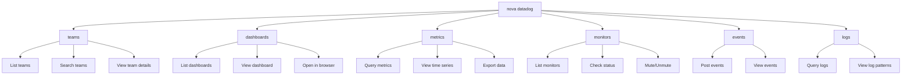
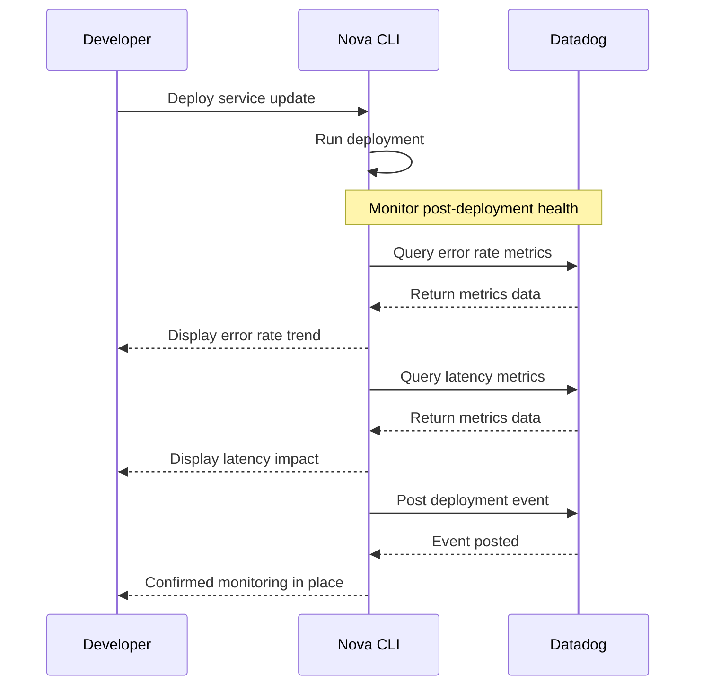

# Datadog Command

The `nova datadog` command provides seamless access to Datadog monitoring and observability features
directly from your terminal, allowing you to view teams, dashboards, metrics, and more without
switching contexts.

!!! info Observability Tools This command helps you access and interact with your Datadog monitoring
data without leaving your development environment.

## Overview

Nova's Datadog integration enables you to monitor application health, track metrics, and view team
information directly from the command line, streamlining your observability workflow.



## Prerequisites

Before using Datadog commands, ensure:

- You have a Datadog account with appropriate access
- Your Nova CLI is configured with Datadog credentials via `nova setup` or `nova config`

```bash
# Configure Datadog credentials
nova config set datadog.api_key "your-api-key"
nova config set datadog.app_key "your-app-key"
nova config set datadog.site "datadoghq.com"
```

## Subcommands

### Teams

```bash
nova datadog teams [options]
```

Lists and searches Datadog teams.

!!! note List All Teams

    ```bash
    nova datadog teams
    ```

!!! note Search Teams

    ```bash
    nova datadog teams --query "engineering"
    ```

!!! note JSON Output

    ```bash
    nova datadog teams --format json
    ```

#### Options

| Option                  | Description                              |
| ----------------------- | ---------------------------------------- |
| `-f, --format <format>` | Output format (text/json, default: text) |
| `-q, --query <string>`  | Search for a team by name                |

#### Example Output

```
Fetching Datadog teams...

┌───────────────────────┬───────────────┬─────────┬─────────────────────┐
│ Name                  │ Handle        │ Members │ Description         │
├───────────────────────┼───────────────┼─────────┼─────────────────────┤
│ Frontend Team         │ frontend      │ 8       │ Web UI development  │
│ Backend Engineering   │ backend       │ 12      │ API and services    │
│ Data Platform         │ data          │ 7       │ Data infrastructure │
└───────────────────────┴───────────────┴─────────┴─────────────────────┘

Total teams: 3
```

### Dashboards

```bash
nova datadog dashboards [options]
```

Lists and views Datadog dashboards.

=== "List Dashboards"

    ```bash
    nova datadog dashboards
    ```

=== "JSON Output"

    ```bash
    nova datadog dashboards --format json
    ```

#### Options

| Option                  | Description                              |
| ----------------------- | ---------------------------------------- |
| `-f, --format <format>` | Output format (text/json, default: text) |

#### Example Output

```
Fetching Datadog dashboards...

┌────────────────────────────┬──────────────────┬───────────────────┬─────────────────┐
│ Title                      │ Type             │ Created By        │ Last Modified   │
├────────────────────────────┼──────────────────┼───────────────────┼─────────────────┤
│ Service Overview           │ timeboard        │ john.doe          │ 2 days ago      │
│ API Performance            │ screenboard      │ jane.smith        │ 1 week ago      │
│ Error Tracking             │ screenboard      │ sam.wilson        │ 3 days ago      │
└────────────────────────────┴──────────────────┴───────────────────┴─────────────────┘

Total dashboards: 3
```

### Metrics (Coming Soon)

```bash
nova datadog metrics [options]
```

Queries and visualizes Datadog metrics.

!!! note Query Metrics

    ```bash
    nova datadog metrics query "avg:system.cpu.user{*}"
    ```

!!! note Specify Time Range

    ```bash
    nova datadog metrics query "avg:system.cpu.user{*}" --from "1h ago" --to "now"
    ```

!!! note Export as CSV

    ```bash
    nova datadog metrics query "avg:system.cpu.user{*}" --output csv --file cpu_metrics.csv
    ```

#### Options

| Option                  | Description                                  |
| ----------------------- | -------------------------------------------- |
| `-f, --from <time>`     | Start time for the query (default: "1h ago") |
| `-t, --to <time>`       | End time for the query (default: "now")      |
| `-o, --output <format>` | Output format (text/json/csv, default: text) |
| `--file <path>`         | Export results to a file                     |

#### Example Output

```
Fetching Datadog metrics...

┌───────────────────────┬───────────────────────┬─────────────┬──────────┐
│ Name                  │ Tags                  │ Latest Value│ Avg Value│
├───────────────────────┼───────────────────────┼─────────────┼──────────┤
│ system.cpu.user       │ host:web-server-01    │ 32.5        │ 28.7     │
│ system.cpu.user       │ host:web-server-02    │ 45.2        │ 39.3     │
│ system.memory.used    │ host:web-server-01    │ 6.2 GB      │ 5.8 GB   │
│ system.memory.used    │ host:web-server-02    │ 8.5 GB      │ 7.9 GB   │
└───────────────────────┴───────────────────────┴─────────────┴──────────┘

Total metrics: 4
```

### Monitors (Planned)

```bash
nova datadog monitors [options]
```

Manages and views Datadog monitors.

!!! note List Monitors

    ```bash
    nova datadog monitors list
    ```

!!! note Check Status

    ```bash
    nova datadog monitors status 12345678
    ```

!!! note Mute Monitor

    ```bash
    nova datadog monitors mute 12345678 --duration 2h --message "Maintenance window"
    ```

#### Options

| Option                  | Description                                 |
| ----------------------- | ------------------------------------------- |
| `-s, --status <status>` | Filter by status (alert, warn, no data, ok) |
| `-q, --query <string>`  | Search monitors by name or query            |
| `-t, --tags <tags>`     | Filter by tags (comma-separated)            |
| `-f, --format <format>` | Output format (text/json, default: text)    |

### Events (Planned)

```bash
nova datadog events [options]
```

Posts and views Datadog events.

!!! note Post Event

    ```bash
    nova datadog events post "Deployment completed" --tags "deployment,production" --priority normal
    ```

!!! note View Events

    ```bash
    nova datadog events list --priority high --sources deployment
    ```

#### Options

| Option                      | Description                         |
| --------------------------- | ----------------------------------- |
| `-t, --tags <tags>`         | Event tags (comma-separated)        |
| `-p, --priority <priority>` | Event priority (normal/low/high)    |
| `-s, --sources <sources>`   | Filter by sources (comma-separated) |
| `--from <time>`             | Start time for event query          |
| `--to <time>`               | End time for event query            |

### Logs (Planned)

```bash
nova datadog logs [options]
```

Queries and analyzes Datadog logs.

!!! note Query Logs

    ```bash
    nova datadog logs query "service:frontend status:error"
    ```

!!! note Live Tail

    ```bash
    nova datadog logs tail "service:api"
    ```

#### Options

| Option                 | Description                                    |
| ---------------------- | ---------------------------------------------- |
| `-f, --from <time>`    | Start time for the query (default: "15m ago")  |
| `-t, --to <time>`      | End time for the query (default: "now")        |
| `-l, --limit <number>` | Maximum number of logs to return (default: 25) |
| `--format <format>`    | Output format (text/json, default: text)       |

## Common Options

These options are available across multiple Datadog commands:

| Option            | Description                                      |
| ----------------- | ------------------------------------------------ |
| `--api-key <key>` | Datadog API key (overrides config)               |
| `--app-key <key>` | Datadog application key (overrides config)       |
| `--site <site>`   | Datadog site (e.g., datadoghq.com, datadoghq.eu) |

## Configuration

The Datadog command uses configuration from your nova config file:

```yaml
datadog:
  api_key: your-api-key
  app_key: your-application-key
  site: datadoghq.com
```

## Integration with Other Commands

Datadog commands can be integrated with other nova features:

```bash
# Check service health after deployment
nova datadog metrics query "avg:service.latency{service:api}"

# Send Datadog events when GitLab pipeline completes
nova gitlab pipelines view 123456 --status success && nova datadog events post "Pipeline 123456 completed successfully" --tags "ci,pipeline,success"

# Include monitor status in Slack notifications
nova datadog monitors status 12345678 | nova slack messages send ops-alerts
```

## Example Workflows

### Service Deployment Monitoring



### Incident Investigation

1. Check monitor status for alerts
   ```bash
   nova datadog monitors list --status alert
   ```

2. View recent high-priority events
   ```bash
   nova datadog events list --priority high --from "6h ago"
   ```

3. Query metrics during the incident timeframe
   ```bash
   nova datadog metrics query "sum:errors.count{service:payment}" --from "6h ago" --to "now"
   ```

4. Examine logs for error patterns
   ```bash
   nova datadog logs query "service:payment status:error" --from "6h ago" --limit 100
   ```

## Tips and Best Practices

!!! tip Working with Metrics - Use precise time ranges to focus on relevant data - Export metrics to
CSV for further analysis in spreadsheets - Combine multiple metrics queries to correlate data points

!!! tip Effective Monitoring - Create consistent tagging schemes across all monitored resources -
Use meaningful event titles for better searchability - Configure appropriate notification channels
for different alert severities

## Troubleshooting

!!! warning Common Issues Solutions for common Datadog command problems.

### Authentication Errors

If you encounter authentication errors:

1. Verify your API and application keys: `nova config get datadog`
2. Ensure your keys have the necessary permissions in Datadog
3. Check that your keys are valid and not expired
4. Regenerate keys if needed in the Datadog UI

### Rate Limiting

If you hit rate limits:

1. Reduce the frequency of API calls
2. Use more specific queries to decrease response sizes
3. Implement caching for frequently accessed data

### Query Syntax

If your metric or log queries aren't returning expected results:

1. Test the query in the Datadog UI first to validate it
2. Ensure proper escaping of special characters
3. Check that time ranges are correctly formatted
4. Verify that tag filters use the correct syntax

## Related Commands

- [`nova ops`](ops.md) - Infrastructure operations
- [`nova slack`](slack.md) - Integration with Slack for notifications
