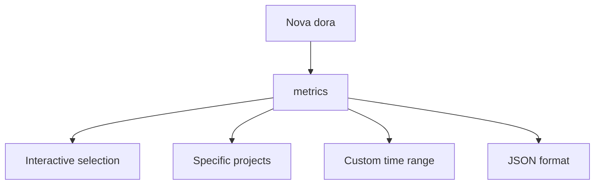

# DORA Metrics Command

The `nova dora` command provides analysis of DORA (DevOps Research and Assessment) metrics for your software delivery performance, helping you measure and improve your development and deployment processes.

!!! info Performance Metrics
    DORA metrics are recognized industry standards for measuring software delivery performance, including deployment frequency, lead time, change failure rate, and time to restore service.

## Overview

Nova's DORA metrics integration helps you track the four key metrics that indicate high-performing software teams, providing insights into your delivery pipelines and identifying areas for improvement.



## Prerequisites

Before using DORA commands, ensure:

- You have appropriate access to your GitLab instance
- You have appropriate access to your Jira instance 
- Both GitLab and Jira are configured in your nova setup

## Current Commands

### Metrics

```bash
nova dora metrics [options]
```

Analyzes DORA metrics for your linked Jira and GitLab projects.

!!! note Interactive Selection

    ```bash
    nova dora metrics
    ```

!!! note Specific Projects

    ```bash
    nova dora metrics --jira PROJECT --gitlab group/project
    ```

!!! note Custom Time Range

    ```bash
    nova dora metrics --time-range 7d
    ```

!!! note JSON Output

    ```bash
    nova dora metrics --format json
    ```

!!! note Refresh Cache

    ```bash
    nova dora metrics --refresh
    ```

#### Options

| Option | Description |
|--------|-------------|
| `-j, --jira <string>` | Jira project key |
| `-g, --gitlab <string>` | GitLab project path |
| `-t, --time-range <timeRange>` | Time range (7d, 30d, 90d) [default: 30d] |
| `-f, --format <format>` | Output format (text/json) [default: text] |
| `--refresh` | Force refresh cached data |
| `--clear-cache` | Clear all cached data before running |

#### Example Output

```
Analyzing DORA metrics for:
- Jira: PROJECT
- GitLab: group/project
- Time range: 30d

┌─────────────────────────┬─────────────┬─────────────────┬────────────────────┐
│ Metric                  │ Value       │ Performance     │ Industry Benchmark │
├─────────────────────────┼─────────────┼─────────────────┼────────────────────┤
│ Deployment Frequency    │ 3.2/week    │ Medium          │ Elite: Daily+      │
│ Lead Time for Changes   │ 3.5 days    │ Medium          │ Elite: <1 day      │
│ Change Failure Rate     │ 12%         │ Medium          │ Elite: 0-15%       │
│ Time to Restore Service │ 4.2 hours   │ High            │ Elite: <1 hour     │
└─────────────────────────┴─────────────┴─────────────────┴────────────────────┘

[...additional custom metrics and trends...]
```

## Planned Future Features

!!! note Coming Soon
    The following features are planned for future releases and are not currently available.

### Analyze (Planned)

```bash
nova dora analyze [options]
```

Will provide more granular analysis of specific DORA metrics.

#### Planned Options

| Option | Description |
|--------|-------------|
| `--metric <metric>` | Specific metric to analyze (deployment-frequency, lead-time, change-failure-rate, time-to-restore) |
| `--from <date>` | Start date for analysis |
| `--to <date>` | End date for analysis |
| `--repository <path>` | Specific repository to analyze |
| `--branch <branch>` | Specific branch to analyze |
| `--benchmark` | Compare against industry benchmarks |

### Report (Planned)

```bash
nova dora report [options]
```

Will generate detailed reports on DORA metrics.

#### Planned Options

| Option | Description |
|--------|-------------|
| `--period <period>` | Reporting period (weekly/monthly/quarterly/yearly) |
| `--format <format>` | Output format (text/json/csv/pdf) |
| `--output <file>` | Save report to file |
| `--detailed` | Include detailed breakdown |

### Trends (Planned)

```bash
nova dora trends [options]
```

Will visualize trends in your DORA metrics over time.

#### Planned Options

| Option | Description |
|--------|-------------|
| `--metric <metric>` | Specific metric to trend |
| `--period <period>` | Trend period (3months/6months/12months/all) |
| `--output <file>` | Save trend chart to file |

### Compare (Planned)

```bash
nova dora compare [options]
```

Will compare DORA metrics across teams, projects, or time periods.

#### Planned Options

| Option | Description |
|--------|-------------|
| `--type <type>` | Comparison type (teams/periods/repositories) |
| `--teams <teams>` | Teams to compare (comma-separated) |
| `--repositories <repos>` | Repositories to compare (comma-separated) |
| `--current <period>` | Current period for comparison |
| `--previous <period>` | Previous period for comparison |

## Configuration

The DORA command uses configuration from your nova config file via the GitLab and Jira settings:

```yaml
gitlab:
  url: https://gitlab.example.com
  token: your-gitlab-token

atlassian:
  jira_url: https://your-org.atlassian.net
  jira_token: your-jira-token
  username: your-email@example.com
```

## Planned Integration with Other Commands

DORA commands could be integrated with other nova features in the future:

```bash
# Generate DORA metrics after a deployment
nova dora metrics --jira PROJECT --gitlab group/project

# Include DORA metrics in team reports (future feature)
nova dora report --period monthly | nova slack message send --channel team-metrics

# Create a GitLab issue with DORA recommendations (future feature)
nova dora analyze --benchmark --format json | jq '.recommendations' | xargs -I{} nova gitlab issues create --title "DORA Improvements" --description "{}"
```

## DORA Metric Definitions

| Metric | Definition | Elite Performance |
|--------|------------|-------------------|
| Deployment Frequency | How often code is deployed to production | Multiple times per day |
| Lead Time for Changes | Time from commit to running in production | Less than one hour |
| Change Failure Rate | Percentage of deployments causing failures | 0-15% |
| Time to Restore Service | Time to restore service after an incident | Less than one hour |

## Troubleshooting

### Data Source Issues

If you encounter issues with data sources:

1. Verify your GitLab and Jira configurations: `nova config get gitlab` and `nova config get atlassian`
2. Ensure API tokens have appropriate permissions
3. Check connectivity to the GitLab and Jira services
4. Validate repository paths and project configurations

### Missing Deployment Data

If deployment data is missing:

1. Ensure your CI/CD pipeline is properly configured
2. Verify deployment jobs are correctly identified
3. Check that the date range includes deployment activities
4. Confirm repository access permissions are correct

### Troubleshooting Commands

```bash
# Clear the cache and retry
nova dora metrics --clear-cache

# Verify you can access both Jira and GitLab
nova jira projects
nova gitlab projects

# Run with refresh to get fresh data
nova dora metrics --refresh
```

## Related Commands

- [`nova gitlab`](gitlab.md) - GitLab integration for code data
- [`nova jira`](jira.md) - Jira issue tracking integration
- [`nova datadog`](datadog.md) - Monitoring and observability
