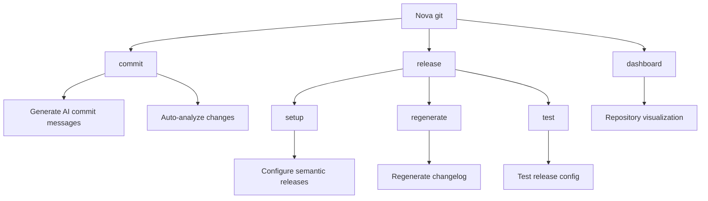
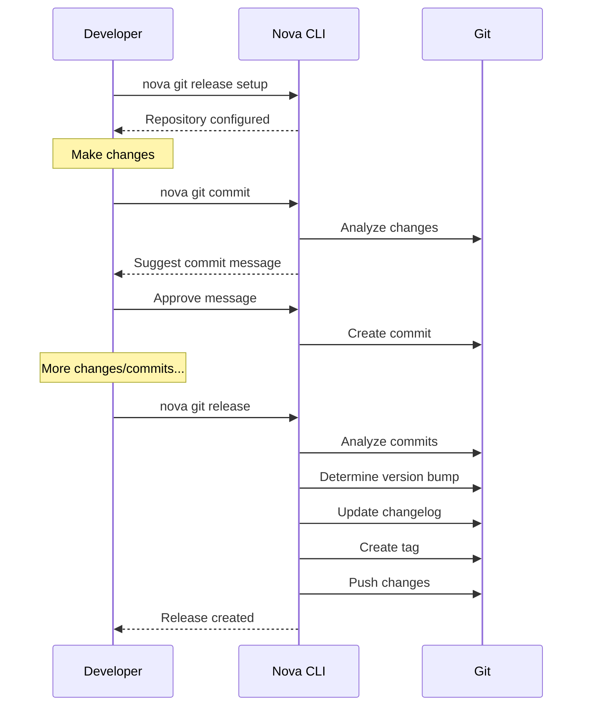

# Git Command

The `nova git` command provides enhanced Git functionality with AI assistance, streamlining your
development workflow with intelligent commit messages, semantic releases, and repository analytics.

!!! info "Git Enhancement" This command augments your existing Git workflow with AI-powered features
for more effective version control and collaboration.

## Overview

nova's Git integration adds intelligent capabilities to standard Git operations, helping developers
create more meaningful commits, manage releases semantically, and visualize repository activity.



## Prerequisites

- Git installed and initialized repository
- Nova CLI configured with OpenAI API key for AI-assisted features

## Subcommands

### Commit

```bash
nova git commit [options]
```

Creates semantically meaningful commit messages by analyzing your changes with AI.

!!! note Basic Usage

    ```bash
    nova git commit
    ```

!!! note With Custom Message

    ```bash
    nova git commit --message "Initial commit"
    ```

!!! note Include Unstaged Changes

    ```bash
    nova git commit --all
    ```

!!! note Preview Without Committing

    ```bash
    nova git commit --no-commit
    ```

#### How It Works

1. Analyzes your staged (or all) changes
2. Generates a descriptive commit message with AI
3. Shows a preview for your approval
4. Creates the commit with the approved message

#### Options

| Option            | Description                                               |
| ----------------- | --------------------------------------------------------- |
| `--all`, `-a`     | Include all changes, not just staged changes              |
| `--message`, `-m` | Provide a custom commit message instead of generating one |
| `--silent`, `-s`  | Run in silent mode with minimal output                    |
| `--no-commit`     | Preview the commit message without creating a commit      |

#### Example Output

```
Analyzing git changes to suggest commit message...

Status of working tree:

Staged changes:
  M src/components/UserProfile.tsx
  M src/styles/profile.css
  M src/api/users.ts

AI-Generated Commit Message:
feat(user-profile): implement responsive design and API improvements

- Add media queries for mobile responsiveness
- Update user profile layout with flex containers
- Refactor API calls for better error handling
- Add loading state indicators

Is this commit message okay? [Y/n] y

✓ Commit created successfully
[main 1a2b3c4] feat(user-profile): implement responsive design and API improvements
 3 files changed, 45 insertions(+), 12 deletions(-)
```

### Release

```bash
nova git release [options]
```

Manages semantic versioning and releases for your repository.

!!! note Create Release

    ```bash
    nova git release
    ```

!!! note Dry Run

    ```bash
    nova git release --dry-run
    ```

!!! note Force Release

    ```bash
    nova git release --force
    ```

#### Subcommands

##### Setup

```bash
nova git release setup
```

Configures your repository for semantic release management by creating or updating a `nova.json`
configuration file.

Example output:

```
Setting up semantic release configuration...

No existing configuration found.
Create a new release configuration? [Y/n] y

Analyzing repository...
Detected tag prefix: "v"
Creating new release configuration...
✓ Created default release configuration

✓ Repository is now configured for semantic releases
```

##### Regenerate

```bash
nova git release regenerate
```

Regenerates the CHANGELOG.md file based on commit history and semantic versioning.

Example output:

```
Regenerating changelog...

Regenerating changelog from git history...
✓ Changelog regenerated successfully
```

##### Test

```bash
nova git release test
```

Tests your release configuration and simulates a release without making any changes.

Example output:

```
Testing release configuration...

✓ Found nova.json
✓ Configuration is valid

Configuration Overview:
--------------------------------------------------
Main branches: main, master
Prerelease branches: develop, dev, staging
Changelog enabled: true
GitLab integration: enabled
--------------------------------------------------

Simulating release...
Current version is 1.2.3
Commits since last release: 12
Analyzed changes: 2 features, 3 fixes, 0 breaking changes
Next version would be: 1.3.0 (minor)

Release notes would be:
# 1.3.0 (2023-10-15)

### Features
* Add dark mode support (#123)
* Implement user notifications system (#124)

### Bug Fixes
* Fix login error on Firefox (#125)
* Address form validation issues (#126)
* Update dependency versions (#127)
```

#### Options

| Option      | Description                                 |
| ----------- | ------------------------------------------- |
| `--dry-run` | Simulate release without making changes     |
| `--force`   | Force a release even if no changes detected |

### Dashboard

```bash
nova git dashboard
```

Displays an interactive dashboard of your repository's current state, including branches, changes,
and status.

Example output:

```
┌─────────────────────────────────┐
│       Repository Overview       │
├───────────────────┬─────────────┤
│ Repository Root   │ /home/user/projects/my-app │
│ Current Branch    │ feature/login │
│ Changed Files     │ 5           │
│ Staged Changes    │ 2           │
│ Unstaged Changes  │ 2           │
│ Untracked Files   │ 1           │
└───────────────────┴─────────────┘

Changed Files:
┌────────┬────────────────────────────┐
│ Status │ File                       │
├────────┼────────────────────────────┤
│ ●      │ src/components/Login.tsx   │
│ ●      │ src/styles/login.css       │
│ ●      │ src/api/auth.ts            │
│ ●      │ src/tests/login.test.ts    │
│ ●      │ src/assets/login-icon.svg  │
└────────┴────────────────────────────┘

Legend:
● Staged changes
● Unstaged changes
● Untracked files
✕ Deleted files
```

## Release Configuration

The `nova.json` file created by `nova git release setup` contains your semantic release
configuration:

```json
{
  "release": {
    "branches": {
      "main": ["main", "master"],
      "prerelease": ["develop", "dev", "staging"]
    },
    "tagPrefix": "v",
    "changelog": {
      "enabled": true,
      "path": "CHANGELOG.md"
    },
    "commitAnalyzer": {
      "preset": "conventional-commits"
    },
    "gitlab": {
      "enabled": true,
      "releaseAssets": []
    }
  }
}
```

### Configuration Options

| Option                  | Description                                         |
| ----------------------- | --------------------------------------------------- |
| `branches.main`         | Branch names considered as main/release branches    |
| `branches.prerelease`   | Branch names considered as prerelease branches      |
| `tagPrefix`             | Prefix used for version tags (e.g., "v" for v1.0.0) |
| `changelog.enabled`     | Whether to generate and update changelog            |
| `commitAnalyzer.preset` | Commit message convention to analyze                |
| `gitlab.enabled`        | Whether to create GitLab releases                   |

## Integration with Other Commands

Git commands can be combined with other nova features:

```bash
# Create AI-assisted commit and push
nova git commit && git push

# Create release and share on Slack
nova git release && nova slack messages send releases "Version 1.3.0 released"

# Check dashboard before coding
nova git dashboard && nova agent eng code-review
```

## Example Workflows

### Semantic Release Workflow



### Daily Development Workflow

1. Start your day with a repository overview
   ```bash
   nova git dashboard
   ```

2. Work on your tasks, then commit with AI assistance
   ```bash
   nova git commit --all
   ```

3. Push your changes
   ```bash
   git push
   ```

4. Prepare for release
   ```bash
   nova git release test
   ```

5. Create the release when ready
   ```bash
   nova git release
   ```

## Tips and Best Practices

!!! tip Better Commit Messages - Make small, focused commits for better AI analysis - Use `--all`
only when changes are related - Review AI suggestions and edit if necessary

!!! tip Effective Releases - Follow [Conventional Commits](https://www.conventionalcommits.org/)
format - Use `feat:`, `fix:`, and `BREAKING CHANGE:` prefixes - Test releases before applying with
`--dry-run`

## Troubleshooting

!!! warning Common Issues Solutions for common Git command problems.

### AI Commit Generation Failures

If you encounter issues with AI commit generation:

1. Check your OpenAI API key: `nova config get openai.api_key`
2. Ensure you have internet connectivity
3. Try with a smaller set of changes
4. Use `--message` to provide your own message

### Release Errors

If releases fail:

1. Verify your Git configuration is correct
2. Check if you have permission to push to the repository
3. Ensure your working directory is clean
4. Try running `nova git release test` first to check for issues

## Related Commands

- [`nova gitlab`](gitlab.md) - GitLab integration
- [`nova agent`](agent.md) - AI-powered development assistance
- [`nova jira`](jira.md) - Create and link issues
