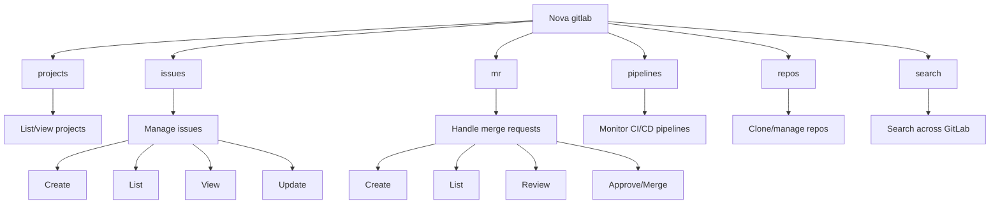
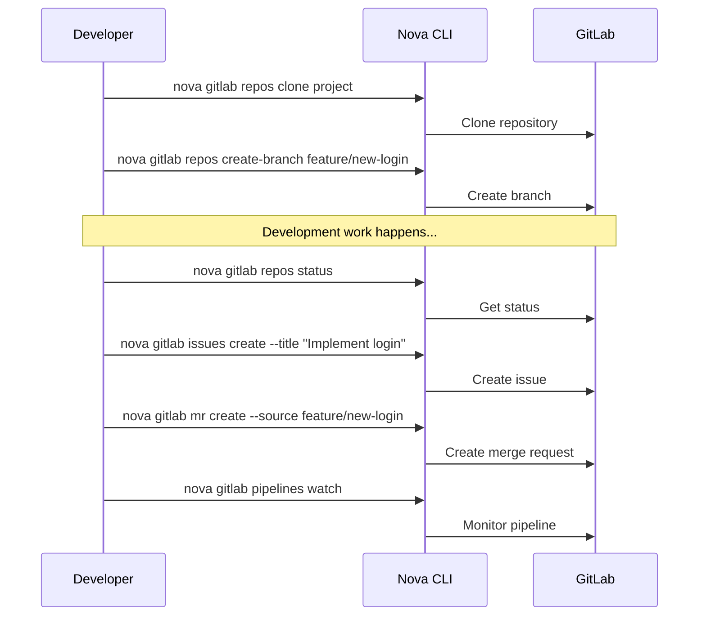

# GitLab Command

The `nova gitlab` command enables you to interact with GitLab repositories and projects directly from your terminal, streamlining your development workflow.

!!! info "Version Control"
    This command helps you manage GitLab projects, issues, merge requests, and pipelines without switching contexts.

## Overview

Nova's GitLab integration provides a seamless interface to GitLab's features, allowing you to manage your repositories, track issues, handle merge requests, and monitor CI/CD pipelines directly from the command line.



## Prerequisites

Before using GitLab commands, you need to configure your GitLab integration:

You can also configure these during the initial setup:

```bash
nova setup
```

## Usage

### Projects

```bash
nova gitlab projects [options]
```

Lists and manages your GitLab projects.

=== "List Projects"

    ```bash
    nova gitlab projects list
    ```

=== "View Project Details"

    ```bash
    nova gitlab projects view my-group/my-project
    ```

=== "Star a Project"

    ```bash
    nova gitlab projects star my-group/my-project
    ```

Example output:

```
┌────────────────────────┬──────────────────────────┬────────────┬──────────┐
│ Project                │ Description              │ Visibility │ Stars    │
├────────────────────────┼──────────────────────────┼────────────┼──────────┤
│ my-group/project-one   │ Main project repository  │ internal   │ 12       │
│ my-group/project-two   │ API service              │ private    │ 5        │
│ my-group/documentation │ Project documentation    │ public     │ 2        │
└────────────────────────┴──────────────────────────┴────────────┴──────────┘
```

### Issues

```bash
nova gitlab issues [subcommand] [options]
```

Manages GitLab issues.

=== "List Issues"

    ```bash
    nova gitlab issues list my-group/my-project
    ```

=== "View Issue"

    ```bash
    nova gitlab issues view my-group/my-project 42
    ```

=== "Create Issue"

    ```bash
    nova gitlab issues create my-group/my-project --title "Fix login bug" --description "Users can't log in with special characters"
    ```

=== "Update Issue"

    ```bash
    nova gitlab issues update my-group/my-project 42 --status "closed"
    ```

Example output for issue listing:

```
┌────┬───────────────────────────┬────────────┬────────────────┬────────────┐
│ ID │ Title                     │ Status     │ Assignee       │ Labels     │
├────┼───────────────────────────┼────────────┼────────────────┼────────────┤
│ 42 │ Fix login bug             │ open       │ johndoe        │ bug, P1    │
│ 43 │ Add dark mode             │ open       │ janesmith      │ feature    │
│ 44 │ Update documentation      │ closed     │ unassigned     │ docs       │
└────┴───────────────────────────┴────────────┴────────────────┴────────────┘
```

### Merge Requests

```bash
nova gitlab mr [subcommand] [options]
```

Manages merge requests (MRs).

!!! note List MRs

    ```bash
    nova gitlab mr list my-group/my-project
    ```

!!! note View MR

    ```bash
    nova gitlab mr view my-group/my-project 15
    ```

!!! note Create MR

    ```bash
    nova gitlab mr create my-group/my-project --source-branch feature/login --target-branch main --title "Implement login feature"
    ```

!!! note Approve MR

    ```bash
    nova gitlab mr approve my-group/my-project 15
    ```

!!! note Merge MR

    ```bash
    nova gitlab mr merge my-group/my-project 15
    ```

Example output for MR listing:

```
┌────┬─────────────────────────────────────┬──────────────┬─────────────────┬────────────┐
│ ID │ Title                               │ Status       │ Author          │ Branch     │
├────┼─────────────────────────────────────┼──────────────┼─────────────────┼────────────┤
│ 15 │ Implement login feature             │ open         │ johndoe         │ feature/login │
│ 16 │ Fix performance issues              │ merged       │ janesmith       │ fix/perf   │
│ 17 │ Update dependencies                 │ closed       │ alicewhite      │ chore/deps │
└────┴─────────────────────────────────────┴──────────────┴─────────────────┴────────────┘
```

### Pipelines

```bash
nova gitlab pipelines [subcommand] [options]
```

Manages CI/CD pipelines.

!!! note List Pipelines

    ```bash
    nova gitlab pipelines list my-group/my-project
    ```

!!! note View Pipeline

    ```bash
    nova gitlab pipelines view my-group/my-project 123
    ```

!!! note Retry Pipeline

    ```bash
    nova gitlab pipelines retry my-group/my-project 123
    ```

!!! note Cancel Pipeline

    ```bash
    nova gitlab pipelines cancel my-group/my-project 123
    ```

Example output for pipeline listing:

```
┌─────┬──────────┬──────────────────┬─────────────────┬────────────────┐
│ ID  │ Status   │ Ref              │ Created         │ Duration       │
├─────┼──────────┼──────────────────┼─────────────────┼────────────────┤
│ 123 │ success  │ main             │ 2h ago          │ 5m 23s         │
│ 122 │ failed   │ feature/login    │ 3h ago          │ 4m 12s         │
│ 121 │ running  │ fix/bug-123      │ Just now        │ running        │
└─────┴──────────┴──────────────────┴─────────────────┴────────────────┘
```

### Repositories

```bash
nova gitlab repos [subcommand] [options]
```

Manages GitLab repositories.

!!! note Clone Repository

    ```bash
    nova gitlab repos clone my-group/my-project
    ```

!!! note View Repository

    ```bash
    nova gitlab repos view my-group/my-project
    ```

!!! note List Branches

    ```bash
    nova gitlab repos branches my-group/my-project
    ```

!!! note Create Branch

    ```bash
    nova gitlab repos create-branch my-group/my-project feature/new-login --from main
    ```

### Search

```bash
nova gitlab search [options]
```

Searches across GitLab projects, issues, merge requests, and more.

!!! note Search Issues

    ```bash
    nova gitlab search issues "login bug"
    ```

!!! note Search Merge Requests

    ```bash
    nova gitlab search mr "performance"
    ```

!!! note Search Code

    ```bash
    nova gitlab search code "function authenticate"
    ```

## Global Options

| Option | Description |
|--------|-------------|
| `-f, --format <format>` | Output format (text/json/yaml) |
| `--project <project>` | Specify the GitLab project path |
| `-r, --recent` | Use most recent project |
| `--url <url>` | GitLab instance URL (overrides config) |
| `--token <token>` | GitLab API token (overrides config) |
| `-h, --help` | Show help information |

## Project-Specific Options

| Option | Description |
|--------|-------------|
| `--visibility <visibility>` | Filter by visibility (public/internal/private) |
| `--owned` | Show only owned projects |
| `--starred` | Show only starred projects |
| `--limit <limit>` | Limit the number of results |

## Issue and MR Options

| Option | Description |
|--------|-------------|
| `--status <status>` | Filter by status (open/closed/all) |
| `--labels <labels>` | Filter by labels (comma-separated) |
| `--assignee <username>` | Filter by assignee |
| `--created-after <date>` | Filter by creation date |
| `--order-by <field>` | Sort results by field |

## Integration with Other Commands

GitLab commands can be integrated with other nova features:

```bash
# Clone a repository and analyze code structure
nova gitlab repos clone my-group/my-project && nova agent eng analyze

# Review a merge request with AI assistance
nova gitlab mr review my-group/my-project 15 --ai

# Create a Jira issue from a GitLab issue
nova gitlab issues view my-group/my-project 42 --create-jira

# Start MCP server in a cloned repository
nova gitlab repos clone my-group/my-project && cd my-project && nova mcp server
```

## Example Workflows

### New Feature Development



### Issue Triage

1. List open issues
   ```bash
   nova gitlab issues list my-group/my-project --status open
   ```

2. View issue details
   ```bash
   nova gitlab issues view my-group/my-project 42
   ```

3. Add labels and assignee
   ```bash
   nova gitlab issues update my-group/my-project 42 --labels "bug,priority:high" --assignee johndoe
   ```

4. Create branch for the issue
   ```bash
   nova gitlab repos create-branch my-group/my-project fix/issue-42 --from main
   ```

## Troubleshooting

!!! warning Common Issues
    Here are solutions to common problems with the GitLab integration.

### Authentication Failures

If you receive authentication errors:

1. Verify your token: `nova config get gitlab.token`
2. Check token permissions in GitLab (needs at least `read_api` scope)
3. Reset your token: `nova setup --reset-gitlab`

### API Rate Limiting

If you encounter rate limiting:

1. Reduce the frequency of requests
2. Use `--refresh` only when necessary
3. Consider using a higher-tier GitLab account

### Project Not Found

If a project is not found:

1. Check the project path format: `group/project`
2. Verify you have access to the project in GitLab
3. Check for typos in the project name

## Related Commands

- [`nova jira`](jira.md) - Jira operations for issue tracking
- [`nova agent`](agent.md) - AI-powered agents for development assistance
- [`nova mcp`](mcp.md) - Model Context Protocol for AI-assisted development 