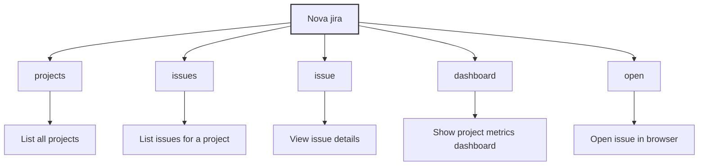

# Jira Command

The `nova jira` command provides an integrated interface to Atlassian Jira directly from your terminal, streamlining issue management and reporting.

!!! tip "Terminal-Based Jira Interface"
    Interact with your Jira projects and issues without leaving your development environment.

## Overview

The Jira command enables seamless interaction with your Jira projects and issues directly from the command line. This integration helps developers stay in their workflow without context switching to the Jira web interface.



## Prerequisites

Before using the Jira commands, ensure:

- You have a valid Jira account with appropriate permissions
- Your Nova CLI is configured with Jira credentials via `nova config` or `nova setup`
- You have network access to your Jira instance

## Commands

<div class="grid cards" markdown>

- :clipboard: __Project Management__

    ---

    List and view Jira projects
    
    ```bash
    nova jira projects
    ```
    
    [➡️ Projects Command](#projects-command)

- :memo: __Issue Management__

    ---

    List and view Jira issues
    
    ```bash
    nova jira issues
    ```
    
    [➡️ Issues Command](#issues-command)

- :bar_chart: __Dashboards__

    ---

    View project metrics and dashboards
    
    ```bash
    nova jira dashboard
    ```
    
    [➡️ Dashboard Command](#dashboard-command)

- :link: __Browser Integration__

    ---

    Open issues in your browser
    
    ```bash
    nova jira open ISSUE-KEY
    ```
    
    [➡️ Open Command](#open-command)

</div>

## Projects Command

```bash
nova jira projects [options]
```

Lists all available Jira projects that you have access to.

### Options

| Option | Description |
|--------|-------------|
| `-f, --format <format>` | Output format (text/json, default: text) |

### Example

```bash
# List all projects in text format
nova jira projects

# Output projects as JSON
nova jira projects --format json
```

Example output:

```
┌───────────┬────────────────────────┬───────────┬─────────────┐
│ Key       │ Name                   │ Type      │ Lead        │
├───────────┼────────────────────────┼───────────┼─────────────┤
│ PROJ      │ Main Project           │ software  │ John Doe    │
│ SUPPORT   │ Customer Support       │ service   │ Jane Smith  │
└───────────┴────────────────────────┴───────────┴─────────────┘

Total projects: 2
```

## Issues Command

```bash
nova jira issues [options]
```

Lists issues for a specified project or based on a JQL query. If no project or query is specified, you'll be prompted to select a project.

### Options

| Option | Description |
|--------|-------------|
| `-p, --project <key>` | Project key to list issues for |
| `-q, --query <jql>` | JQL query to search issues |
| `-l, --limit <number>` | Maximum number of issues to return (default: 20) |
| `-f, --format <format>` | Output format (text/json, default: text) |
| `--show-completed` | Include completed issues in results |

### Example

```bash
# List issues for a specific project
nova jira issues --project PROJ

# List issues with a custom JQL query
nova jira issues --query "assignee = currentUser() AND status = 'In Progress'"

# Show only 10 issues
nova jira issues --project PROJ --limit 10
```

Example output:

```
PROJ-123  [🟢 In Progress] Login button not working
┬ Assignee: John Doe
┴ Updated: 2 hours ago

PROJ-124  [🟡 To Do] Implement password reset
┬ Assignee: Unassigned
┴ Updated: Yesterday

PROJ-125  [🔵 Backlog] Add social login options
┬ Assignee: Jane Smith
┴ Updated: 3 days ago

Total issues: 3
```

## Issue Command

```bash
nova jira issue <issue-key> [options]
```

Shows detailed information about a specific issue.

### Options

| Option | Description |
|--------|-------------|
| `-f, --format <format>` | Output format (text/json, default: text) |

### Example

```bash
# View details for a specific issue
nova jira issue PROJ-123

# Output issue details as JSON
nova jira issue PROJ-123 --format json
```

Example output:

```
Issue: PROJ-123
Summary: Login button not working
Type: 🐞 Bug
Status: 🟢 In Progress
Priority: 🔥 High
Assignee: John Doe
Reporter: Jane Smith
Created: 2023-06-15 (5 days ago)
Updated: 2023-06-20 (2 hours ago)

Description:
The login button on the homepage is not clickable in Safari browsers.
Steps to reproduce:
1. Open homepage in Safari
2. Click on login button
3. Nothing happens

Acceptance Criteria:
- Button works in Safari version 15+
- No regression in other browsers

Comments:
[Jane Smith, 2023-06-15]
I've verified this on Safari 15.3 and 16.0.

[John Doe, 2023-06-20]
Found the issue - it's a z-index problem. Working on a fix.
```

## Dashboard Command

```bash
nova jira dashboard [project-key] [options]
```

Shows a metrics dashboard for a Jira project. If no project is specified, you'll be prompted to select one.

### Options

| Option | Description |
|--------|-------------|
| `-f, --format <format>` | Output format (table/json, default: table) |
| `-d, --days <number>` | Number of days to analyze (default: 84) |
| `-r, --recent` | Show dashboard for most recently viewed project |
| `--refresh` | Force refresh cached data |
| `-b, --board <id>` | Specific board ID to analyze |

### Example

```bash
# Show dashboard for a specific project
nova jira dashboard PROJ

# Show dashboard for the most recently viewed project
nova jira dashboard --recent

# Analyze the last 30 days
nova jira dashboard PROJ --days 30
```

Example output:

```
PROJECT DASHBOARD: Main Project (PROJ)
─────────────────────────────────────────────────────

📊 ISSUE STATISTICS
Total Issues: 128
Open Issues: 45 (35%)
In Progress: 23 (18%)
Completed: 60 (47%)

📈 VELOCITY CHART (Last 12 weeks)
Week 1: ███████ 7
Week 2: ████████ 8
Week 3: ██████ 6
Week 4: ████████████ 12
Week 5: ████ 4
Week 6: ██████████ 10
Week 7: ███████ 7
Week 8: ██████ 6
Week 9: ████████ 8
Week 10: ███████████ 11
Week 11: █████████ 9
Week 12: ████████ 8

Average Velocity: 8.0 issues per week

⏱️ CYCLE TIME
Average time from 'In Progress' to 'Done': 4.3 days
```

## Open Command

```bash
nova jira open <issue-key>
```

Opens a specific Jira issue in your default web browser.

### Example

```bash
# Open an issue in the browser
nova jira open PROJ-123
```

## Global Options

| Option | Description |
|--------|-------------|
| `-h, --help` | Show help information |

## Environment Variables

The following environment variables can affect Jira command behavior:

| Variable | Description | Example |
|----------|-------------|---------|
| `ATLASSIAN_TOKEN` | Jira API token | `export ATLASSIAN_TOKEN="your-token"` |
| `JIRA_URL` | URL of your Jira instance | `export JIRA_URL="https://your-domain.atlassian.net"` |

## Troubleshooting

!!! failure Authentication Failures
    If you encounter authentication errors:
    
    1. Verify your Jira token is valid
    2. Check your Jira URL is correct
    3. Run `nova setup` to reconfigure Jira credentials
    4. Ensure your token has the necessary permissions

!!! failure Issue Not Found
    If an issue cannot be found:
    
    1. Check that you have the correct issue key
    2. Verify you have permission to view the issue
    3. Ensure the issue hasn't been deleted

!!! failure Performance Issues
    If commands are slow:
    
    1. Use a more specific JQL query to limit results
    2. Add a lower `--limit` value when listing issues
    3. Consider using cached results instead of `--refresh`

## Related Commands

- [`nova setup`](setup.md) - Setup Nova with Jira credentials
- [`nova config`](config.md) - Manage Jira configuration 