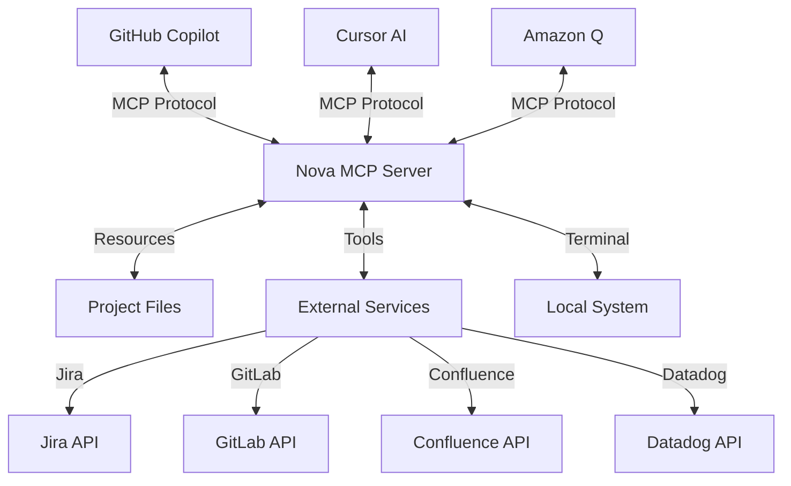
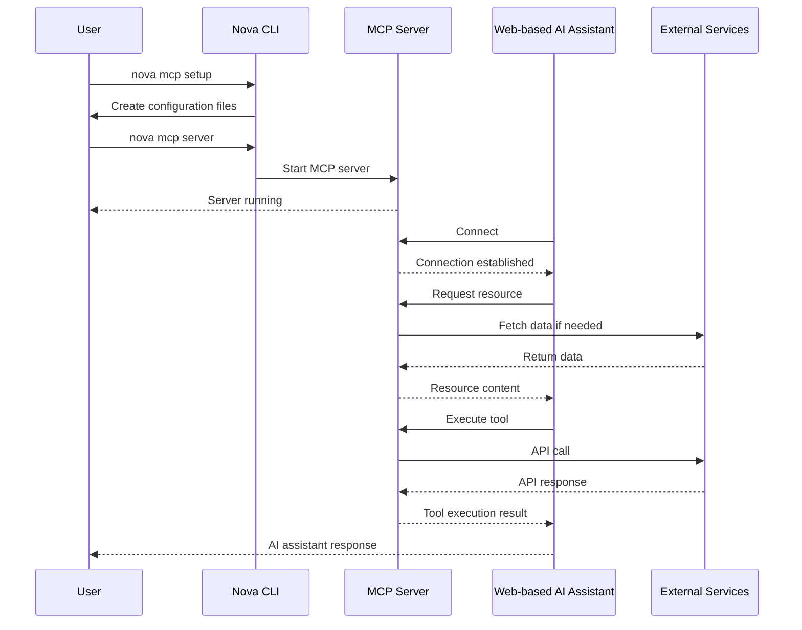
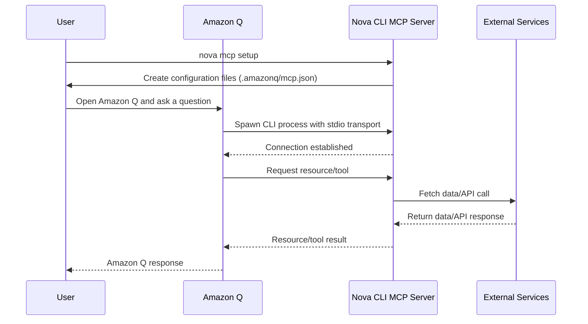
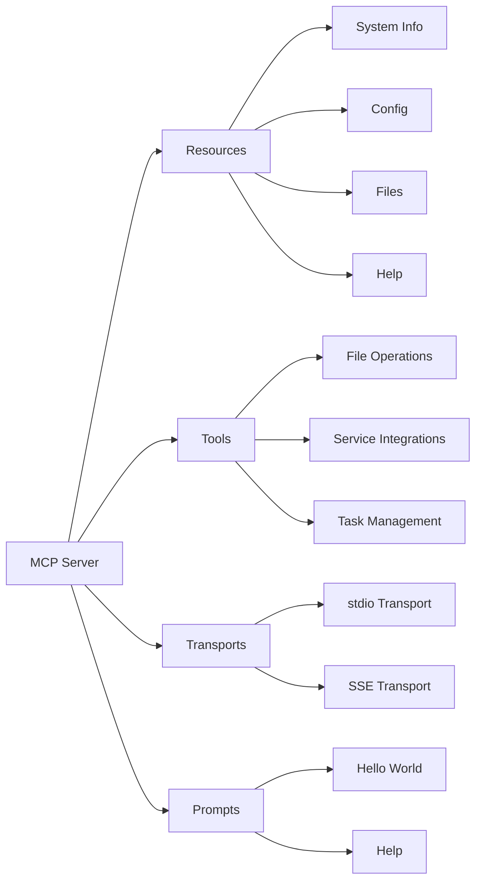

# MCP Command

The `nova mcp` command manages Model Context Protocol (MCP) operations, enabling AI tools like
GitHub Copilot to interact with your development environment and services.

!!! tip AI Integration MCP provides a standardized way for AI models to access your project
resources and tools.

## Overview

The Model Context Protocol (MCP) command provides functionality for setting up, running, and
managing MCP servers that expose your project's resources and tools to AI assistants through a
standardized protocol.

Nova's MCP implementation supports multiple AI assistants and IDEs:

- **GitHub Copilot** - Using the SSE transport
- **Cursor AI** - Using the SSE transport
- **Amazon Q** - Using the optimized stdio transport
- **VS Code Extensions** - Using the SSE transport

The MCP server can use different transport types based on the AI assistant's requirements:

- **SSE (Server-Sent Events)** - For web-based assistants
- **stdio** - For direct integration with tools like Amazon Q
- **Web** - For HTTP-based applications

### MCP Architecture



The diagram above shows how the MCP server acts as a bridge between AI assistants and your
development resources.

## Usage

```bash
nova mcp <subcommand> [options]
```

## Subcommands

| Subcommand | Description                                      |
| ---------- | ------------------------------------------------ |
| `setup`    | Set up MCP configuration for the current project |
| `server`   | Start the MCP server                             |
| `help`     | Show help information for MCP commands           |

## MCP Workflow

### Standard Workflow (Web-based AI Assistants)



### Amazon Q Workflow (stdio Transport)



These sequence diagrams show the typical workflows when using the MCP server with different AI
assistants.

## MCP Setup

```bash
nova mcp setup [options]
```

### Setup Options

| Option       | Description                                           |
| ------------ | ----------------------------------------------------- |
| `--force`    | Force setup even if configuration files already exist |
| `-h, --help` | Show help information                                 |

!!! note "Project Setup" The setup command creates configuration files in your project directory,
not in your global nova configuration.

### Setup Examples

!!! note Basic Setup `bash
    # Set up MCP in current repository
    nova mcp setup`

!!! note Force Overwrite
`bash
    # Force overwrite existing configuration
    nova mcp setup --force`

## MCP Server

```bash
nova mcp server [options]
```

### Server Options

| Option                    | Description                                                      |
| ------------------------- | ---------------------------------------------------------------- |
| `--port <port>`           | HTTP port for SSE transport (default: 3020)                      |
| `--transport <type>`      | Transport type to use: `sse`, `stdio`, or `web` (default: `sse`) |
| `--endpoint <path>`       | Endpoint for SSE/Web transport (default: /mcp)                   |
| `--inspect <address>`     | Enable inspector on host:port (default: 127.0.0.1:9229)          |
| `--inspect-brk <address>` | Enable inspector and break at start of script                    |
| `--allow-all`             | Allow all permissions                                            |
| `-h, --help`              | Show help information                                            |

### Server Examples

!!! note Default Server (SSE)
`bash
    # Start the MCP server with default settings (SSE transport)
    nova mcp server`

!!! note Stdio Transport
`bash
    # Start with stdio transport only
    nova mcp server --transport=stdio`

!!! note Web Transport
`bash
    # Start with web transport on custom port
    nova mcp server --transport=web --port=4000`

!!! note Custom Endpoint
`bash
    # Start with custom SSE endpoint
    nova mcp server --endpoint=/api/mcp`

!!! note Debug Mode `bash
    # Start with debug logging
    NOVA_DEBUG=true nova mcp server`

## MCP Server Components



The component diagram shows the main parts of the MCP server architecture.

## MCP Prompts

The MCP server includes predefined prompt templates that can be used with compatible AI assistants.
Currently, the following prompts are available:

- **hello_world**: A simple welcome message from the Nova MCP server
- **help**: Display help information about available tools and features

Prompts can be accessed via the Model Context Protocol by AI assistants that support this feature.

## Starting the Server

To start the MCP server, use the `mcp` command:

```bash
nova mcp
```

By default, this will start the server using the SSE transport on port 3020.

### Options

- `--port <port>`: Set the HTTP port for the server (default: 3020)
- `--transport <transport>`: Transport type to use (sse or stdio, default: sse)
- `--endpoint <endpoint>`: Endpoint for HTTP/SSE transport (default: /mcp)

## Server Transports

The MCP server supports multiple transport mechanisms to communicate with AI assistants.

## Environment Variables

| Variable     | Description                             |
| ------------ | --------------------------------------- |
| `NOVA_DEBUG` | Enable debug logging when set to `true` |

## Available MCP Resources

When the MCP server is running, it exposes the following resources:

| Resource URI    | Description                                      |
| --------------- | ------------------------------------------------ |
| `system://info` | System information about the current environment |
| `config://nova` | Nova configuration information (sanitized)       |
| `file://{path}` | Access to files by path                          |
| `help://usage`  | Help information about using the MCP server      |

!!! tip Resources vs Tools Resources are read-only data sources, while tools can perform actions
with side effects. Use resources when you just need to access data, and tools when you need to
perform operations.

## Available MCP Tools

The MCP server exposes tools in the following categories:

### File Operations

- `file_read` - Read file content
- `list_dir` - List contents of a directory
- `run_terminal_cmd` - Run a system command

### Project Management

- `gitlab_search` - Search GitLab projects, issues, or merge requests
- `gitlab_create_issue` - Create a new GitLab issue
- `jira_search` - Search for Jira issues using JQL
- `jira_search` - Search for Jira issues using JQL
- `jira_create_issue` - Create a new Jira issue
- `jira_list_projects` - List all Jira projects
- `jira_list_issues` - List all issues in a Jira project
- `jira_get_issue` - Get details for a specific Jira issue

### Documentation

- `confluence_search` - Search for content in Confluence
- `confluence_create_page` - Create a new Confluence page

### Monitoring

- `datadog_search` - Search for metrics or logs in Datadog
- `dora_metrics` - Get DORA metrics for a project

### Task Management

- `init_task` - Initialize a new task environment
- `write_task_file` - Write a file in a task directory
- `read_task_file` - Read a file from a task directory
- `get_task_info` - Get task metadata information

## Configuration Files

MCP setup creates the following configuration files:

| File                              | Description                                         |
| --------------------------------- | --------------------------------------------------- |
| `.vscode/mcp.json`                | VS Code MCP configuration (SSE transport)           |
| `.cursor/mcp.json`                | Cursor IDE MCP configuration (SSE transport)        |
| `.amazonq/mcp.json`               | Amazon Q MCP configuration (stdio transport)        |
| `.github/copilot-instructions.md` | Instructions for GitHub Copilot (updated if exists) |

!!! example Example MCP Configuration Files

    !!! note VS Code / Cursor (SSE)
        ```json
        {
          "servers": {
            "nova-mcp": {
              "command": "nova",
              "type": "sse",
              "args": ["mcp", "server", "--transport=sse"],
              "name": "nova MCP SSE Server",
              "url": "http://localhost:3020/mcp",
              "version": "1.0.0",
              "debug": true
            }
          }
        }
        ```

    !!! note Amazon Q (stdio)
        ```json
        {
          "mcpServers": {
            "nova-mcp-stdio": {
              "workingDir": "/path/to/your/project",
              "command": "nova",
              "type": "stdio",
              "args": ["mcp", "server", "--transport=stdio"],
              "name": "nova MCP Server",
              "version": "1.0.0", 
              "debug": false,
              "env": {
                "PWD": "/path/to/your/project"
              }
            }
          }
        }
        ```

## Transport Types

The MCP server supports multiple transport types to connect with AI assistants:

### SSE Transport

Server-Sent Events (SSE) is the default transport for web-based AI assistants:

```bash
nova mcp server --transport=sse --port=3020
```

This transport is used by VS Code and Cursor by default.

### stdio Transport

The stdio transport is used for direct integration with editors and tools:

```bash
nova mcp server --transport=stdio
```

The stdio transport has been optimized with:

- Complete suppression of all console output
- Early detection and handling of stdio transport
- Silent initialization process
- Faster startup time

This ensures clean JSON communication without log noise interference, making it ideal for tools like
Amazon Q that require a clean stdio channel.

### Web Transport

HTTP-based transport for web applications:

```bash
nova mcp server --transport=web --port=3020
```

## Integrating with IDE Extensions

The MCP server can be used with IDE extensions that support the Model Context Protocol:

!!! note VS Code VS Code extensions can connect to the MCP server using the configuration in
`.vscode/mcp.json`. You'll need to start the server separately with `nova mcp server`.

!!! note Cursor Cursor has built-in support for MCP and will use the configuration in
`.cursor/mcp.json`. You'll need to start the server separately with `nova mcp server`.

!!! note Amazon Q Amazon Q will automatically connect to the MCP server using the stdio transport
configuration in `.amazonq/mcp.json`. The server will be started automatically when needed, so you
don't need to start it separately.

!!! note GitHub Copilot GitHub Copilot can use the MCP server to access your project resources and
services. The setup command will update `.github/copilot-instructions.md` with guidance for using
MCP tools.

## Troubleshooting

!!! question MCP Server Won't Start 1. Check if there's already an MCP server running (check with
`ps aux | grep "mcp server"`) 2. Make sure the port isn't in use (try `lsof -i :3020`) 3. Try using
a different transport with `--transport=stdio` or `--transport=web`

!!! question AI Assistant Can't Access Resources 1. Make sure the MCP server is running (for SSE/Web
transports) 2. Check that the AI assistant is properly configured to use the MCP server 3. Verify
that the resources you're trying to access exist and are accessible 4. For Amazon Q, ensure the
`.amazonq/mcp.json` file exists and has the correct configuration

!!! question Tool Execution Fails 1. Run the server with `NOVA_DEBUG=true` to see detailed logs (not
for stdio transport) 2. Make sure the service you're trying to use is properly configured 3. Check
that you have the necessary permissions for the operation 4. For Amazon Q, check that the tool is
being called with the correct parameters

!!! question Amazon Q Fails to Connect 1. Verify that `.amazonq/mcp.json` exists and has the correct
configuration 2. Ensure the `type` is set to `stdio` in the configuration 3. Make sure `debug` is
set to `false` to prevent console output interference 4. Check that the `workingDir` path in the
configuration is correct

## Related Documentation

- [CopilotMCP Overview](../../copilot-mcp/overview.md) - Overview of the CopilotMCP integration
- [First Steps with CopilotMCP](../../copilot-mcp/first-steps.md) - Getting started with CopilotMCP
- [Using CopilotMCP](../../copilot-mcp/usage.md) - Detailed usage guide for CopilotMCP
- [Troubleshooting CopilotMCP](../../copilot-mcp/troubleshooting.md) - Solutions for common issues
