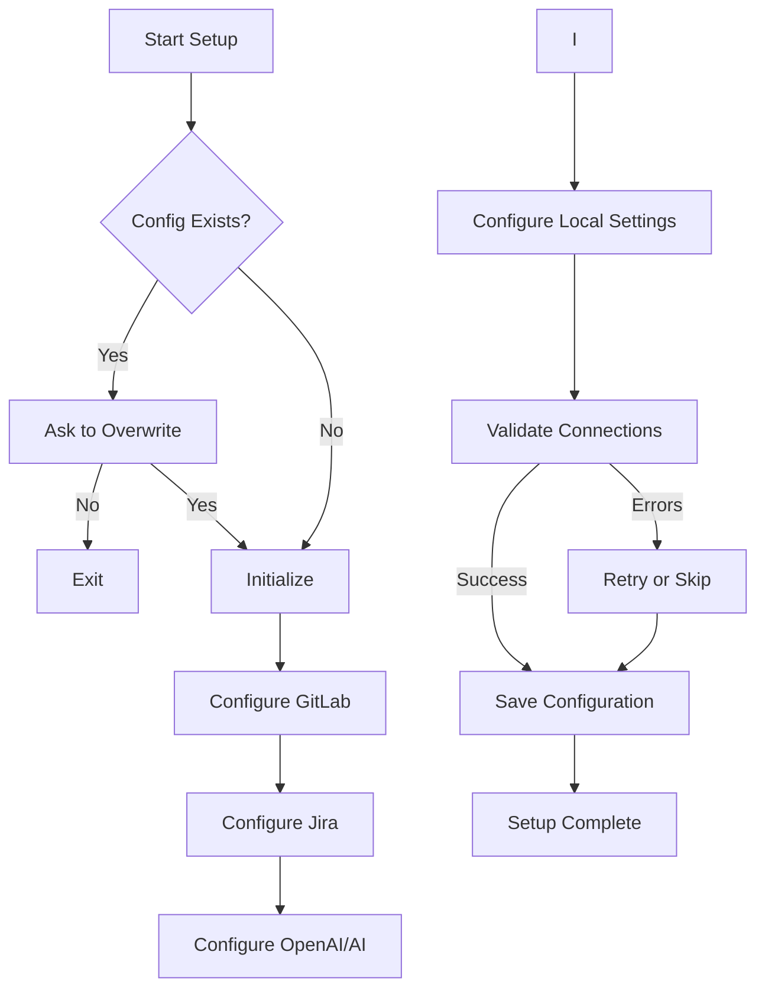

# Setup Command

The `nova setup` command provides an interactive setup wizard to configure Nova CLI with your service credentials and preferences.

!!! tip First Step
    This is typically the first command you should run after installing nova CLI.

## Overview

This command guides you through the initial setup process for Nova CLI, configuring access to various services like GitLab, Jira, OpenAI, and more.

## Setup Process Flow



## Usage

```bash
nova setup [options]
```

## Options

| Option | Description |
|--------|-------------|
| `--skip-test` | Skip connection tests after setup |
| `-h, --help` | Show help information |

## Examples

!!! note Basic Setup

    ```bash
    # Run the interactive setup wizard
    nova setup
    ```

## Configuration Process

The setup command will guide you through configuring:

!!! example "Example Terminal Output"

    ```
    🤖 nova CLI Setup Wizard
    
    This wizard will help you configure nova CLI with your credentials
    and preferences.
    
    ? Do you want to configure GitLab? [Y/n] Y
    ? GitLab URL: https://gitlab.example.com
    ? GitLab Personal Access Token: ********
    ✓ GitLab connection successful!
    
    ? Do you want to configure Jira? [Y/n] Y
    ? Jira URL: https://jira.example.com
    ? Jira Username: user@example.com
    ? Jira API Token: ********
    ✓ Jira connection successful!
    
    [...]
    
    ✨ Setup completed successfully!
    ```

## Configuration Storage

All credentials and settings are stored in:

```
~/.nova/config.json
```

!!! warning Security Note
    The configuration file is encrypted to protect your credentials, but you should still ensure that your system is secure and that unauthorized users cannot access your account.

## Validation

The setup process includes validation steps for:
- API token validity
- Connection tests
- Permission checks

!!! note Connection Test Skip
    If you know that some services aren't available or you want to set up offline, you can use the `--skip-test` option to bypass connection validation.

## Related Commands

- [`nova config`](config.md) - View or modify specific configuration settings
- [`nova update`](update.md) - Update nova CLI to the latest version

## Troubleshooting

If you encounter issues during setup:

!!! failure GitLab Connection Failed
    1. Check that your GitLab URL is correct
    2. Verify your Personal Access Token has the correct permissions
    3. Ensure your network can access the GitLab instance

!!! failure Jira Connection Failed
    1. Verify your Jira URL (e.g., https://your-domain.atlassian.net)
    2. Check your Jira API token permissions
    3. Try regenerating your API token from your Atlassian account

!!! failure OpenAI Configuration Issues
    1. Make sure your API key is valid and has not expired
    2. For Azure OpenAI, verify the endpoint URL format is correct
    3. Check that you have access to the specified model

## Notes

- You can rerun `setup` at any time to reconfigure your installation
- Environment variables can override configuration (see [Configuration](../getting-started/configuration.md)) 