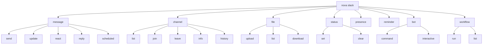
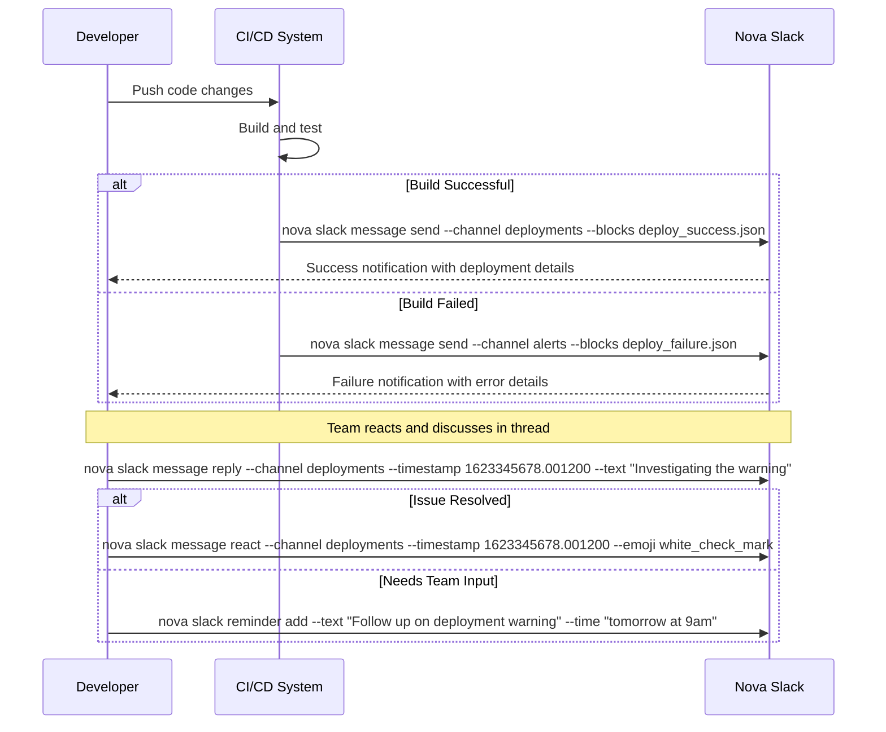

# Slack Command (Planned Feature)

!!! warning Planned Feature
    This command is planned for future implementation and is not currently available in Nova CLI.

The `nova slack` command provides seamless integration with Slack, enabling communication, notifications, and interactive workflows directly from your terminal.

!!! tip "Stay Connected"
    Use the Slack command to keep your team informed without leaving your development environment.

## Overview

The Slack command allows you to interact with Slack channels, send messages, post updates, share files, and create interactive workflows—all directly from the CLI. This integration streamlines team communication within your development workflow.



## Prerequisites

Before using the Slack commands, ensure:

- You have a valid Slack workspace and account
- Your Nova CLI is configured with Slack credentials via `nova config` or `nova setup`
- You have the necessary permissions in your Slack workspace

## Usage

### Message Management

```bash
nova slack message [subcommand] [options]
```

Send and manage Slack messages.

!!! note Send Message

    ```bash
    nova slack message send --channel general --text "Deployment to staging completed successfully"
    ```

!!! note Send with Blocks

    ```bash
    nova slack message send --channel devops --blocks blocks.json
    ```

!!! note Update Message

    ```bash
    nova slack message update --channel general --timestamp 1623345678.001200 --text "Updated: Deployment completed with warnings"
    ```

!!! note Add Reaction

    ```bash
    nova slack message react --channel general --timestamp 1623345678.001200 --emoji thumbsup
    ```

!!! note Reply to Thread

    ```bash
    nova slack message reply --channel general --timestamp 1623345678.001200 --text "Adding more context to this deployment"
    ```

!!! note Schedule Message

    ```bash
    nova slack message scheduled --channel general --text "Reminder: Team meeting at 10 AM" --time "2023-07-01T10:00:00-07:00"
    ```

Example output for sending a message:

```
Sending message to #general...

Message details:
- Text: Deployment to staging completed successfully
- Sender: nova CLI (as your-username)
- Sent with: Blocks format with deployment status

✓ Message sent successfully
Timestamp: 1623345678.001200
Thread URL: https://workspace.slack.com/archives/abc/def

Message formatted with:
- 1 header block
- 1 section block
- 1 divider
- 1 context block
```

### Channel Management

```bash
nova slack channel [subcommand] [options]
```

Interact with Slack channels.

!!! note List Channels

    ```bash
    nova slack channel list
    ```

!!! note Join Channel

    ```bash
    nova slack channel join --channel project-updates
    ```

!!! note Leave Channel

    ```bash
    nova slack channel leave --channel old-project
    ```

!!! note Channel Info

    ```bash
    nova slack channel info --channel devops
    ```

!!! note Channel History

    ```bash
    nova slack channel history --channel deployments --count 10
    ```

Example output for channel listing:

```
Available Slack Channels:

#general
    Purpose: Announcements and work-related matters
    Members: xy
    Last active: 5 minutes ago
    
#devops
    Purpose: Deployment and infrastructure discussions
    Members: xy
    Last active: 18 minutes ago
    
#project-abc
    Purpose: Development team for Project ABC
    Members: xy
    Last active: 2 hours ago
    
#help-technical
    Purpose: Technical support for internal tools
    Members: xy
    Last active: 1 day ago

You are a member of xy/tz channels in this workspace.
```

### File Management

```bash
nova slack file [subcommand] [options]
```

Upload and manage files in Slack.

!!! note Upload File

    ```bash
    nova slack file upload --channels development --file ./reports/test-results.pdf --title "Latest Test Results" --initial-comment "Here are the test results from the last build"
    ```

!!! note List Files

    ```bash
    nova slack file list --channel project-alpha --types pdf,images --count 10
    ```

!!! note Download File

    ```bash
    nova slack file download --file ABCDEF --output ./downloads/
    ```

Example output for uploading a file:

```
Uploading file to Slack...

File: ./reports/test-results.html
Size: 2.4 MB
Channels: #development
Title: Latest Test Results
Initial comment: Here are the test results from the last build

✓ File uploaded successfully
File ID: ABCDEF
Download URL: https://files.slack.com/files-pri/asdfs/test-results.pdf
Public URL: https://slack-files.com/asdf-ab1cd2
```

### Status Management

```bash
nova slack status [subcommand] [options]
```

Manage your Slack status.

!!! note Set Status

    ```bash
    nova slack status set --text "Working on deployment" --emoji rocket --expiration 60
    ```

!!! note Clear Status

    ```bash
    nova slack status clear
    ```

Example output for setting a status:

```
Setting your Slack status...

Status text: Working on deployment
Emoji: :rocket:
Expiration: 60 minutes (will clear at 15:00)

✓ Status set successfully

Your current Slack status is now:
🚀 Working on deployment
```

### Presence Management

```bash
nova slack presence [options]
```

Manage your presence in Slack.

!!! note Set Active

    ```bash
    nova slack presence --status active
    ```

!!! note Set Away

    ```bash
    nova slack presence --status away
    ```

Example output for setting presence:

```
Updating your Slack presence...

New status: active (online)

✓ Presence updated successfully
```

### Reminder Management

```bash
nova slack reminder [subcommand] [options]
```

Create and manage Slack reminders.

!!! note Add Reminder

    ```bash
    nova slack reminder add --text "Review PR #123" --time "tomorrow at 10am"
    ```

!!! note List Reminders

    ```bash
    nova slack reminder list
    ```

!!! note Delete Reminder

    ```bash
    nova slack reminder delete --id Rm12345678
    ```

Example output for adding a reminder:

```
Creating Slack reminder...

Text: Review PR #123
Time: Tomorrow at 10:00 AM (2025-01-01T10:00:00)

✓ Reminder created successfully
Reminder ID: Rm12345678
```

### Bot Interactions

```bash
nova slack bot [subcommand] [options]
```

Interact with Slack bots and apps.

!!! note Execute Command

    ```bash
    nova slack bot command --command "/poll 'Lunch options?' 'Pizza' 'Salad' 'Sushi'" --channel team-lunch
    ```

!!! note Interactive Response

    ```bash
    nova slack bot interactive --payload interactive_payload.json --response-url "https://hooks.slack.com/actions/T0123/B123/X123"
    ```

Example output for executing a command:

```
Executing Slack command: /poll

Channel: #team-lunch
Command: /poll 'Lunch options?' 'Pizza' 'Salad' 'Sushi'

✓ Command executed successfully
Response visible in channel
```

### Workflow Management

```bash
nova slack workflow [subcommand] [options]
```

Trigger and manage Slack workflows.

!!! note Run Workflow

    ```bash
    nova slack workflow run --workflow-id Wf12345 --inputs workflow_inputs.json
    ```

!!! note List Workflows

    ```bash
    nova slack workflow list
    ```

Example output for running a workflow:

```
Triggering Slack workflow...

Workflow ID: Wf12345
Name: Deployment Notification
Inputs: 
  - service: backend-api
  - version: v2.3.3
  - environment: prod

✓ Workflow triggered successfully
Execution ID: Ex67890
```

## Global Options

| Option | Description |
|--------|-------------|
| `--token <token>` | Slack token (overrides config) |
| `--workspace <id>` | Slack workspace ID (overrides config) |
| `--as-user <username>` | Act as a specific user (admin only) |
| `--debug` | Show API requests and responses |
| `--no-format` | Disable message formatting |
| `--json` | Output results as JSON |
| `-h, --help` | Show help information |

## Message Options

| Option | Description |
|--------|-------------|
| `--channel <channel>` | Channel to send message to |
| `--text <text>` | Message text |
| `--blocks <json/file>` | Message blocks in JSON format or file path |
| `--attachments <json/file>` | Message attachments in JSON format or file path |
| `--mrkdwn` | Enable Slack markdown formatting |
| `--timestamp <ts>` | Message timestamp (for updates) |
| `--thread-ts <ts>` | Thread timestamp (for replies) |
| `--unfurl` | Enable link unfurling |

## Configuration

The Slack command uses configuration from your nova config file:

```yaml
slack:
  # Connection details
  token: myAwesomeToken
  workspace: workspace-id
  
  # Default values
  default_channel: general
  
  # Message templates
  templates:
    deployment: |
      {
        "blocks": [
          {
            "type": "header",
            "text": {
              "type": "plain_text",
              "text": "Deployment Status: {{status}}"
            }
          },
          {
            "type": "section",
            "text": {
              "type": "mrkdwn",
              "text": "*Service:* {{service}}\n*Environment:* {{environment}}\n*Version:* {{version}}"
            }
          }
        ]
      }
    alert: |
      {
        "blocks": [
          {
            "type": "header",
            "text": {
              "type": "plain_text",
              "text": "🚨 ALERT: {{title}}"
            }
          },
          {
            "type": "section",
            "text": {
              "type": "mrkdwn",
              "text": "{{description}}"
            }
          }
        ]
      }
```

## Integration with Other Commands

Slack commands can be integrated with other nova features:

```bash
# Send Git commit details to Slack
nova git commit -m "Fix login issue" && nova slack message send --channel dev-updates --text "Committed fix for login issue"

# Share Jira issue details on Slack
nova jira issue view PROJECT-123 | nova slack message send --channel project-alpha

# Post build results to Slack
nova build run --environment staging && nova slack message send --channel deployments --template deployment --vars "status=Success,service=backend-api,environment=staging,version=1.2.3"

```

## Example Workflows

### Deployment Notification Workflow



### Daily Standup Workflow

1. Prepare standup report
   ```bash
   nova git log --author $(git config user.email) --since yesterday > today_standup.txt
   nova jira my issues --status "In Progress" >> today_standup.txt
   ```

2. Format and send to Slack
   ```bash
   nova slack message send --channel team-standup --text "Daily update" --file today_standup.txt
   ```

3. Add reminders for follow-ups
   ```bash
   nova slack reminder add --text "Check with DevOps about server config" --time "today at 2pm"
   ```

## Message Formatting

Slack messages can be formatted in several ways:

### Simple Text Messages

```bash
nova slack message send --channel general --text "Simple message with *bold* and _italic_ text"
```

### Block Kit Builder Messages

For complex messages, use Block Kit format:

```json
{
  "blocks": [
    {
      "type": "section",
      "text": {
        "type": "mrkdwn",
        "text": "*Project Update:* New release ready for testing"
      }
    },
    {
      "type": "divider"
    },
    {
      "type": "section",
      "fields": [
        {
          "type": "mrkdwn",
          "text": "*Version:*\n2.1.0"
        },
        {
          "type": "mrkdwn",
          "text": "*Release Date:*\nJuly 1, 2023"
        }
      ]
    },
    {
      "type": "actions",
      "elements": [
        {
          "type": "button",
          "text": {
            "type": "plain_text",
            "text": "View Release Notes"
          },
          "url": "https://example.com/releases/2.1.0"
        }
      ]
    }
  ]
}
```

Save this as `release_notification.json` and use:

```bash
nova slack message send --channel releases --blocks release_notification.json
```

### Template-based Messages

Use predefined templates with variables:

```bash
nova slack message send --channel deployments --template deployment --vars "status=Success,service=backend-api,environment=staging,version=1.2.3"
```

## Troubleshooting

!!! warning Common Issues
    Solutions for common Slack command problems.

### Authentication Issues

If you encounter authentication errors:

1. Verify your Slack token: `nova config get slack.token`
2. Ensure your token has the necessary scopes and permissions
3. Check that your token hasn't expired or been revoked
4. Regenerate your token in the Slack API dashboard if needed

### Rate Limiting

If you hit rate limits:

1. Add delay between consecutive API calls
2. Batch messages when possible
3. Check your current rate limit status: `nova slack debug rate-limits`

### Message Formatting Problems

If messages don't appear as expected:

1. Validate your Block Kit JSON using Slack's Block Kit Builder
2. Check for proper escaping of special characters
3. Ensure you're using `--mrkdwn` flag when necessary
4. Test complex messages with `--preview` before sending

## Related Commands

- [`nova git`](git.md) - Git integration with Slack notifications
- [`nova jira`](jira.md) - Jira integration for issue tracking
- [`nova config`](config.md) - Configuration management
- [`nova setup`](setup.md) - Setup nova with Slack credentials 