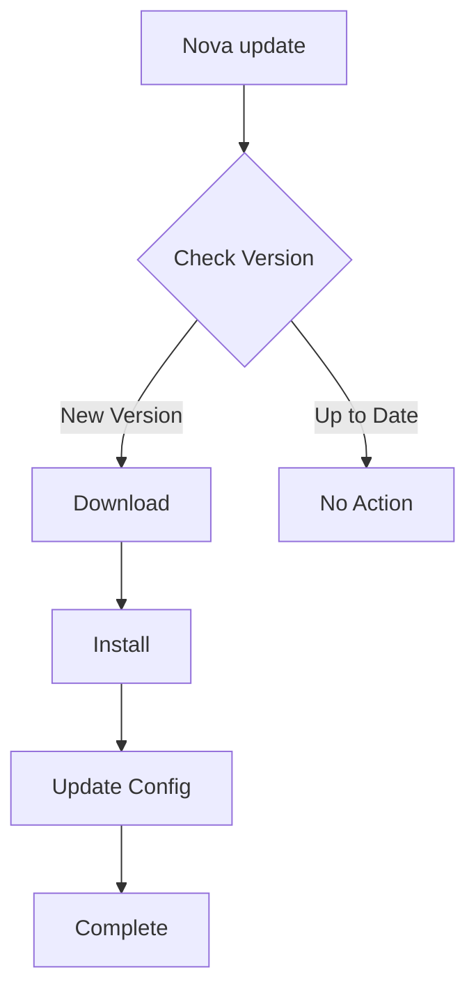

# Update Command

The `nova update` command allows you to update Nova CLI to the latest version, ensuring you have
access to the newest features, bug fixes, and security updates.

!!! tip Stay Current Regularly updating Nova CLI helps ensure compatibility with service
integrations and provides access to the latest features.

## Overview

The update command checks for new versions of nova CLI and performs the update process with minimal
interruption to your workflow. It can also update specific components or plugins.



## Usage

```bash
nova update [options]
```

## Options

| Option                | Description                                    |
| --------------------- | ---------------------------------------------- |
| `--check`             | Only check for updates without installing      |
| `--force`             | Force update even if already on latest version |
| `--no-config`         | Skip configuration migration                   |
| `--version <version>` | Install a specific version                     |
| `-h, --help`          | Show help information                          |

## Examples

!!! note Basic Update

    ```bash
    # Update to the latest version
    nova update
    ```

!!! note Check for Updates

    ```bash
    # Check if updates are available without installing
    nova update --check
    ```

!!! note Force Update

    ```bash
    # Force update even if already on latest version
    nova update --force
    ```

!!! note Specific Version

    ```bash
    # Install a specific version
    nova update --version 1.5.0
    ```

## Update Process

When you run the update command, Nova CLI performs the following steps:

1. **Version Check**: Compares your current version with the latest available version
2. **Download**: Downloads the new version package if available
3. **Backup**: Creates a backup of your current configuration
4. **Installation**: Installs the new version
5. **Config Migration**: Migrates your settings to be compatible with the new version
6. **Cleanup**: Removes temporary files and old backups

!!! example Example Terminal Output

    ```
    🤖 nova CLI Update

    Current version: 1.4.2
    Latest version: 1.5.0

    ✨ New version available! Updating...

    Downloading nova CLI v1.5.0...
    ✓ Download complete

    Installing...
    ✓ Installation complete

    Migrating configuration...
    ✓ Configuration migrated successfully

    Update completed successfully!
    New version: 1.5.0
    ```

## Configuration Migration

During updates, Nova CLI automatically migrates your configuration to be compatible with the new
version. This includes:

- Updating configuration schema
- Adding new default options
- Converting deprecated settings to new formats

!!! warning Configuration Backup A backup of your configuration is always created before migration
at `~/.nova/config.json.backup-[timestamp]`.

## Automatic Updates

Nova CLI periodically checks for updates when you run commands. When a new version is detected,
you'll see a notification:

```
🚀 A new version of nova CLI is available (1.5.0).
Run 'nova update' to update to the latest version.
```

## Troubleshooting

!!! failure Permission Denied If you encounter permission issues during the update:

    ```
    Error: EACCES: permission denied
    ```

    Try running the update command with sudo:

    ```bash
    sudo nova update
    ```

!!! failure Network Issues If you're behind a corporate firewall or have network connectivity
issues:

    1. Check your internet connection
    2. Try using a network proxy if required:
       ```bash
       export HTTP_PROXY=http://proxy.example.com:8080
       export HTTPS_PROXY=http://proxy.example.com:8080
       nova update
       ```

!!! failure Corrupted Installation If your installation becomes corrupted during update:

    1. Uninstall nova CLI completely:
       ```bash
       npm uninstall -g nova
       ```

    2. Reinstall from scratch:
       ```bash
       npm install -g nova
       ```

## Related Commands

- [`nova setup`](setup.md) - Run the setup wizard to configure Nova CLI
- [`nova config`](config.md) - Manage your Nova CLI configuration
